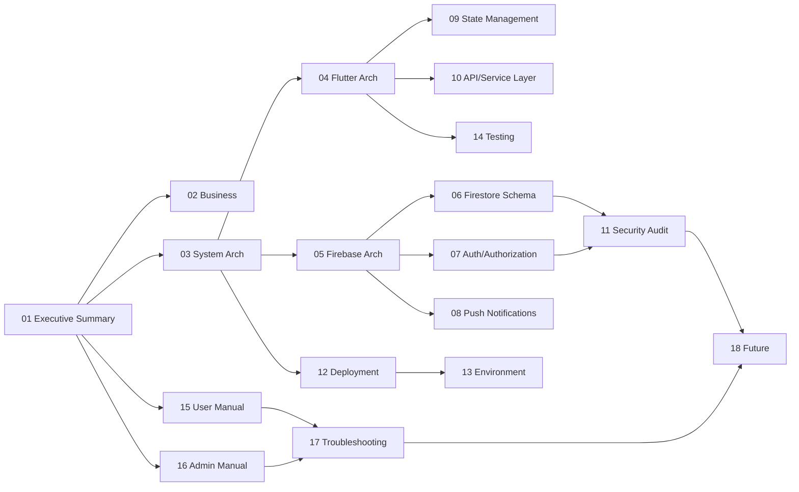

# 01 — Executive Summary

## Product

**Zyppi Ride** is a multi-role ride-hailing and goods-transport mobile application built on Flutter and Firebase. A single application binary serves two distinct user roles — **Customers** (who book rides) and **Drivers / Vehicle Owners** (who fulfil rides) — with the post-login experience driven by a `role` field stored on the user's Firestore document.

The platform handles the full ride lifecycle from search and booking through driver assignment, OTP-verified pickup, live trip tracking, cash settlement, and post-trip rating. A separately maintained web admin panel (referenced in code by the `isAdmin` flag and Firestore-rule paths, but outside this Flutter repository) handles driver verification, fare/policy adjustments, and support ticket triage.

## Headline capabilities

| Capability | Implementation |
|---|---|
| Multi-role single binary | `lib/router/router.dart` with role-aware redirects + post-login route from `users/{uid}.role` |
| Three sign-in methods | Email/password, Google Sign-In, Phone+OTP (Firebase Auth) |
| Real-time booking flow | `BookingService` + Firestore live snapshots, status enum `pending → confirmed → driverArriving → arrived → inProgress → completed` |
| OTP-verified pickup | 6-digit OTP generated server-side at booking creation, pushed to passenger via Cloud Function over FCM |
| Live driver location | `LiveLocationService` streams `Geolocator` positions (≥10 m delta) into `drivers/{driverId}` |
| Fare computation | `FareCalculator` — base + per-km + per-min + waiting (3 min free, ₹2/min after) + 5 % GST + 5 % platform fee, with 10 % night and 15 % peak-hour surcharges |
| Document-gated driver onboarding | `verificationStatus` enum (pending → submitted → approved/rejected), enforced both client-side (`verification_provider.dart`) and server-side (`firestore.rules`) |
| Push notifications | Firebase Cloud Messaging via `firebase_messaging` + `flutter_local_notifications` for in-app display |
| Support center | Complaints + feedback collections with Cloud-Function-generated ticket IDs (`ZY-YYYYMMDD-XXX`, `FB-YYYYMMDD-XXX`) |
| Vehicle catalog | Read-only `vehicleCatalog/india2025` document seeded by an admin-only Cloud Function — Indian OEMs with private & commercial classifications |
| Saved addresses, offers, banners | Per-user subcollection + admin-managed marketing collections |

## Technology stack at a glance

```
Client:   Flutter 3.9+  /  Riverpod 2.5  /  go_router 17  /  Material 3 (Poppins)
Backend:  Firebase Auth · Cloud Firestore · Cloud Storage · Cloud Functions (Node.js)
          Cloud Messaging · App Check (Play Integrity / App Attest) · Analytics
Maps/Loc: geolocator 14 · geocoding 4 · google_places_flutter 2
Other:    cloud_functions 6 · signature 6 (e-agreement) · pinput / sms_autofill (OTP)
```

## Business model touch-points (as evidenced by code)

- **Revenue capture** is implemented as a 5 % `platformFeePercent` deduction from driver earnings (`FareCalculator.calculateDriverEarnings`). GST at 5 % is added on top of the gross fare.
- **Cancellation policy** is a 20 % of-base-fare fee when the rider cancels a *confirmed* booking more than 2 minutes after acceptance (`FareCalculator.calculateCancellationFee` and `BookingService.cancelBooking`).
- **Manual cash settlement** is the only fully implemented payment flow today. Drivers record received amounts on completed bookings (`BookingService.recordPaymentReceived`), with `paymentStatus` flipping to `completed` once `remainingAmount == 0`. UPI / card / wallet / netbanking enum values exist (`PaymentMethod`) but have no live gateway integration in the client code.

## State of the codebase — honest snapshot

- **115 Dart source files**, **~12 Cloud Functions / utility scripts**, comprehensive Firestore rules (333 lines) and indexes (~24 composite indexes).
- **Riverpod-only** state management, no `ChangeNotifier`. Service layer returns a `Result<T>` sealed type that surfaces typed `AppException` subtypes instead of throwing.
- **E2E test mode** is wired through `TestMode` (collections re-prefixed under `e2e_test_*` when launched with `--dart-define=E2E_TEST_MODE=true`), enabling integration tests against an isolated Firestore namespace.
- **Known active issues** documented in `CLAUDE.md` and re-validated here: four service routes (`goodsTransport`, `miniTruckDelivery`, `bikeParcel`, `emergencyVehicle`) are defined in `routes_name.dart` *and* now do have `GoRoute` entries in `router.dart` (the original gap has been partially closed). One stale string mismatch on booking-status filters (`in_progress` vs `inProgress`) called out in `CLAUDE.md` no longer appears in `BookingService` — the code uses `BookingStatus.inProgress.name`, which evaluates to `"inProgress"`.
- **Release signing** still uses the debug keystore (Android `build.gradle.kts` — `signingConfigs.getByName("debug")`). A production keystore must be configured before any Play Store upload (see [12 — Deployment Guide](12-deployment-guide.md)).
- **Security-rule maturity** is high: server-side enforces verification gating, prevents `isAdmin` self-escalation, locks fare/payment fields after trip completion, and constrains driver location reads to admins, the driver themselves, and the user currently riding with them.

## Documentation map


