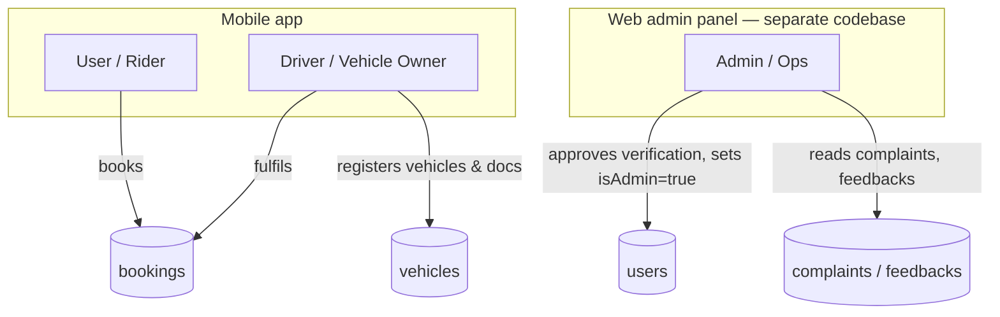
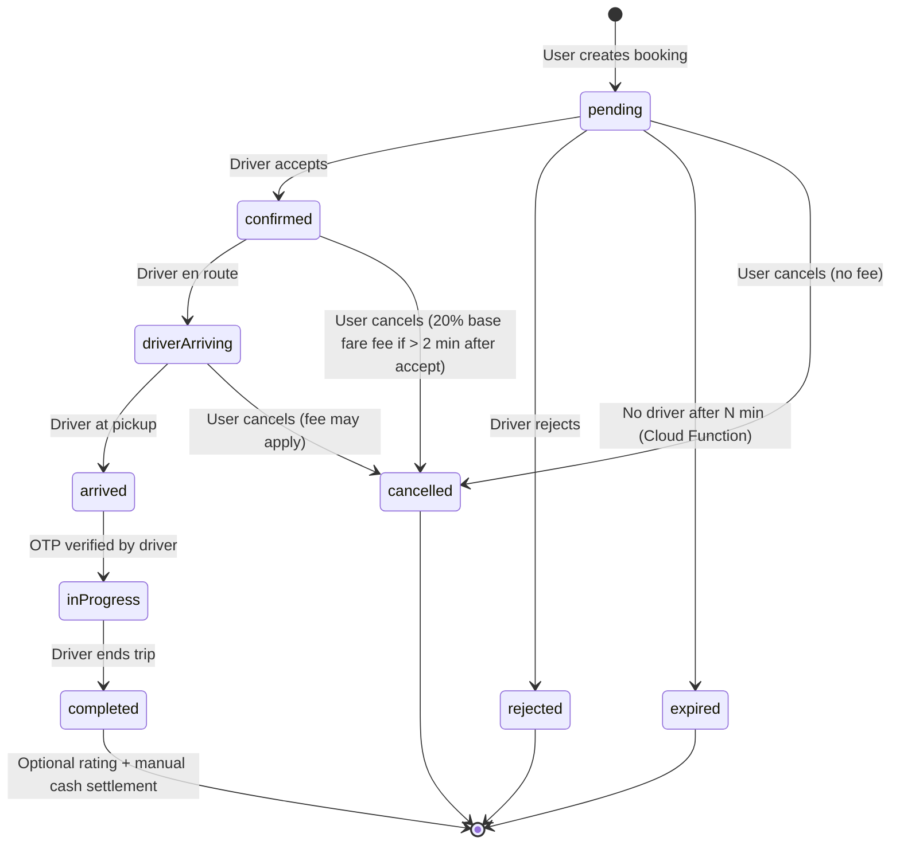

# 02 — Business Documentation

## Service catalogue

Zyppi Ride is a marketplace connecting **passengers** and **goods senders** to **vehicle owners / drivers**. The mobile app offers the following user-facing service entry points (see `lib/router/router.dart`):

| Service | Route | Implementing screen |
|---|---|---|
| Reserve any vehicle (general flow) | `/reserve-vehicle` | `ReserveVehicleScreen` |
| Local transport (within city) | `/local-transport` | `LocalTransportScreen` |
| Outstation / long-distance | `/outstation` | `OutstationScreen` |
| Goods carrier (generic) | `/book-goods-carrier`, `/goods-transport` | `BookGoodsCarrierScreen` |
| Mini truck delivery | `/mini-truck-delivery` | `BookGoodsCarrierScreen(initialVehicleType: 'Mini Truck')` |
| Bike parcel | `/bike-parcel` | `BookGoodsCarrierScreen(initialVehicleType: 'Bike')` |
| Emergency vehicle | `/emergency`, `/emergency-vehicle` | `EmergencyScreen` |
| Vehicle catalog browse | (within booking flow) | `VehicleDetailsScreen` |
| Offers & rewards | `/offers-rewards` | `OffersRewardsScreen`, `PromotionsScreen` |
| Saved addresses | `/saved-addresses` | `SavedAddressesScreen` |
| Ride history (rider) | `/user-ride-history` | `UserRideHistoryScreen` |
| Driver dashboard | `/driver-booking-dashboard` | `DriverBookingDashboardScreen` |
| Support center | `/support-center` | `SupportCenterScreen` |

> Driver-side and rider-side routes share one binary. The post-login destination is decided by reading `users/{uid}.role` (`AuthService.getUserRole`).

## User roles



| Role | How it's set | Where it's enforced |
|---|---|---|
| **User** (rider) | `role` field on user document, set during `RoleSelectionScreen` | Client-side dashboard routing; no special server gate |
| **Driver / Vehicle Owner** | `role` = `"Driver"` or `"Vehicle Owner"` (also accepts lower-case `"driver"`, `"owner"` — `UserModel.isDriver`) | `firestore.rules` enforces `verificationStatus == 'approved'` *and* per-vehicle `documentStatus == 'approved'` before `isOnline` can be set |
| **Admin** | `isAdmin: true` on the user document. **Cannot be set by the user** — server rules block any client write that includes `isAdmin` | `firestore.rules` `isAdmin()` helper used to gate `vehicles` update/delete, `complaints`/`feedbacks` reads, banner/offer writes |

## Booking lifecycle



Implementation references: `lib/models/booking_model.dart` (enum `BookingStatus`), `lib/services/booking_service.dart` (`updateStatus`, `acceptBooking`, `rejectBooking`, `driverArrived`, `startTrip`, `completeTrip`, `cancelBooking`).

## Pricing model

Defined in `lib/utils/fare_calculator.dart`. Per-vehicle `PricingInfo` carries `basePrice`, `perKmRate`, `perHourRate`, `minimumFare`.

| Component | Rule |
|---|---|
| Base fare | `pricing.basePrice` |
| Distance fare | `distanceKm × pricing.perKmRate` |
| Time fare | `durationMinutes × (pricing.perHourRate / 60)` |
| Waiting charges | First 3 minutes free, then ₹2 / minute |
| Toll charges | Pass-through, entered manually |
| Night surcharge | +10 % of subtotal between 22:00 and 06:00 |
| Peak-hour surcharge | +15 % of subtotal Mon–Fri 08:00–10:00 and 17:00–20:00 |
| GST | +5 % of subtotal |
| Promo discount | Percentage of subtotal, capped at 50 % |
| Minimum fare | `pricing.minimumFare` floor |
| Driver earnings | `totalFare − 5 %` platform fee |
| Cancellation fee | 20 % of base fare (only after 2 min from confirmation) |

## Revenue & settlement (current implementation)

- **Booking creation** stores a six-digit `rideOtp` and a `FareDetails` snapshot in the booking document.
- **Payment method** is one of `cash | upi | card | wallet | netBanking`. Only **cash** has a working settlement path today.
- **Cash settlement** (`BookingService.recordPaymentReceived`):
  - Only callable by the assigned driver on a *completed* booking.
  - Writes `amountReceived`, `remainingAmount`, `paymentReceivedAt`, `paymentReceivedBy`, `paymentRecordedManually: true`.
  - Flips `paymentStatus` to `completed` once `remainingAmount ≤ 0`.
  - Enforced by `firestore.rules` — drivers can only touch this restricted set of fields when `status == 'completed'`.

## Marketing & promotions

- **Offers** (`offers` collection) — promo codes with `discount`, `isActive`, `expiryDate`. Resolved at booking creation by `BookingService._getPromoDiscount`.
- **Banners** (`banners`) and **Offer banners** (`offer_banners`) — surfaced on `UserDashboard` via `BannerSlider` and `OfferBannerSlider`. Admin-writable; client read-only.

## Verification & onboarding (driver)

```mermaid
flowchart LR
  S1[Sign up] --> S2[Select role = Driver]
  S2 --> S3[Register vehicle\nVehicleRegistrationScreen]
  S3 --> S4[Upload documents\nDocumentUploadScreen]
  S4 --> S5[Sign agreement\nAgreementSigningScreen]
  S5 --> S6{Admin review\nweb panel}
  S6 -->|approve| S7[verificationStatus = approved]
  S6 -->|reject|  S8[verificationStatus = rejected]
  S7 --> S9[Driver can toggle vehicle online]
  S8 --> S4
```

The agreement document ID format is `{uid}_{vehicleId}` — enforced by the regex in `firestore.rules`. Agreements are immutable after creation (no client update or delete).

## Support center

Two collections — both populated via callable Cloud Functions to guarantee unique sequential ticket IDs:

| Channel | Cloud Function | Document ID format |
|---|---|---|
| Complaints | `exports.createComplaint` (`functions/feedback-suggestion-fun.js`) | `ZY-YYYYMMDD-{3-digit random}` |
| Feedback | `exports.createFeedback` (same file) | `FB-YYYYMMDD-{3-digit random}` |

Both endpoints accept either an authenticated context (`context.auth.uid`) or an explicit `data.userId`, falling back to `unauthenticated` if neither is provided. Admins read both via the web admin panel (`firestore.rules` gates reads behind `isAdmin()` plus per-owner reads).

## Service-area data

The vehicle search dropdowns (city, type) are backed by an admin-maintained `metadata/vehicleSearchMeta` document, which is incrementally updated via `arrayUnion` each time a new vehicle is registered (`VehicleService._updateSearchMeta`). This keeps dropdown queries to a single-document read rather than a full-collection scan.

## Operating geography

Per the seeded `vehicleCatalog/india2025` document, the platform is scoped to **India** with Indian-market vehicle makes, models, and license-plate formats (`utils/vehicle_number_formatter.dart`). Currency is `₹` throughout `FareCalculator.formatFare`.
