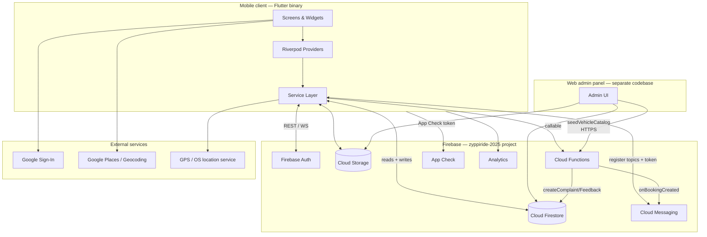
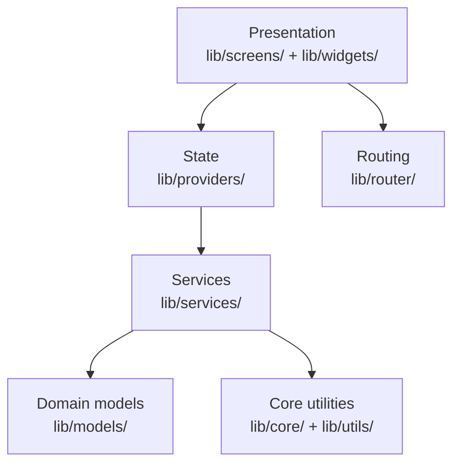
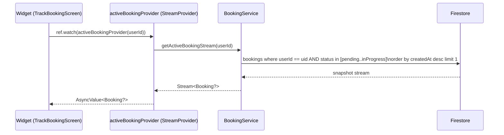
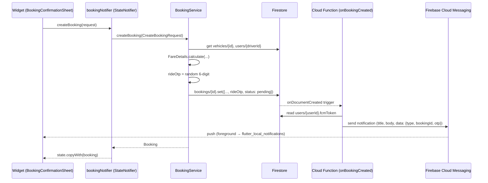
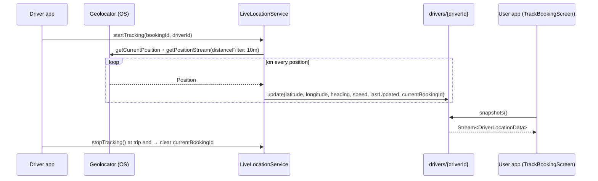
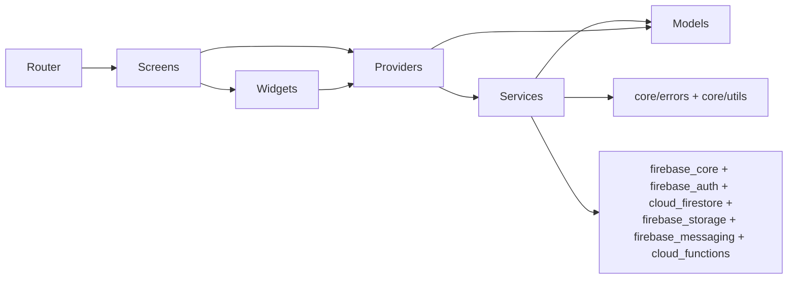

# 03 — System Architecture

## High-level topology

## Layered view of the mobile client

- **Presentation** — `ConsumerWidget`/`ConsumerStatefulWidget` only (no `StatefulWidget` + `setState` over async data). Reads providers via `ref.watch` and triggers actions via `ref.read(notifier).method()`.
- **State** — Riverpod `Provider`, `StreamProvider`, `FutureProvider`, `StateNotifierProvider`. No `ChangeNotifier`. Family providers parameterise by `userId` / `vehicleId`.
- **Services** — plain Dart classes wrapping Firebase. Return `Future<Result<T>>` instead of throwing.
- **Models** — immutable data classes with `fromMap`/`toMap` and defensive `_parseDouble`/`_parseInt`/`_parseDateTime` helpers (Firestore can return `int` where a `double` is expected).
- **Core / utils** — `Result<T>`, `AppException` hierarchy, `AppLogger` (gates output on `kDebugMode`), `TestMode`, `FareCalculator`, `PaginationCursor` helpers.
- **Routing** — `GoRouter` with global `redirect` guard; route name constants in `RoutesName`.

## Request / data-flow patterns

### Read flow (live booking)

### Write flow (create booking)

### Live location flow

## Cross-cutting concerns

| Concern | Implementation |
|---|---|
| Error model | `lib/core/errors/app_exceptions.dart` (AuthException, DatabaseException, ValidationException, NetworkException, StorageException, UnknownException). `ErrorHandler.handle(e, st)` converts Firebase exceptions into typed `AppException`s. |
| Result type | `Result<T>` sealed class (Success / Failure) with `when`, `map`, `flatMap`, `getOrThrow`, `getOrElse`. Wrapped via `runCatching` / `runCatchingSync`. |
| Logging | `AppLogger` (info/warning/error/debug/success/firestore/userAction). Output suppressed in release builds via `kDebugMode`. |
| Offline cache | Firestore persistence enabled in `main.dart` with a 100 MB cache cap. |
| App attestation | Firebase App Check — Play Integrity (Android release), App Attest (iOS release), debug provider for debug/profile. |
| Background messaging | `firebaseMessagingBackgroundHandler` registered as a top-level `@pragma('vm:entry-point')` function in `notification_service.dart`. |
| Global snackbars | `scaffoldMessengerKey` exported from `main.dart` so snackbars survive route changes. |

## Module dependency graph (selected)

## Build artefacts

| Platform | Output | Build command |
|---|---|---|
| Android (Play Store) | `app/build/outputs/bundle/release/app-release.aab` | `flutter build appbundle --release` |
| Android (sideload / QA) | `app/build/outputs/flutter-apk/app-release.apk` | `flutter build apk --release` |
| iOS | Xcode-archived `.ipa` (release scheme) | `flutter build ipa --release` (requires Apple signing) |

The repository also has `web/`, `macos/`, `windows/`, `linux/` scaffolds carried by `flutter create`, but they are **not** the supported delivery targets — no platform-specific configuration has been added beyond the defaults.
