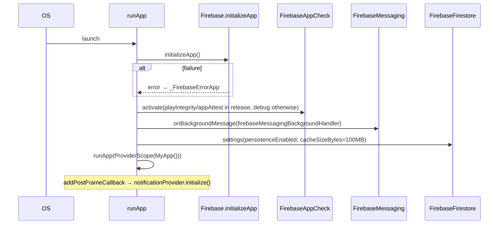

# 04 — Flutter Architecture

## Directory layout (`lib/`)

```
lib/
├── main.dart                # entry point, Firebase init, App Check, FCM bg handler
├── core/
│   ├── core.dart            # public barrel
│   ├── constants/test_mode.dart
│   ├── errors/
│   │   ├── result.dart      # Result<T> sealed class + runCatching helpers
│   │   ├── app_exceptions.dart
│   │   ├── error_handler.dart
│   │   └── errors.dart      # barrel
│   └── utils/
│       ├── app_logger.dart
│       └── pagination.dart  # PaginatedResult<T>
├── models/                  # 11 immutable data classes
├── providers/               # 11 Riverpod providers/notifiers
├── services/                # 11 Firebase-facing services (Result<T>-returning)
├── screens/                 # 47 screens (rider + driver + auth + shared)
├── widgets/                 # reusable composites — dashboard, booking, driver, etc.
├── router/
│   ├── router.dart          # GoRouter + global auth redirect
│   └── routes_name.dart     # route-name constants
└── utils/
    ├── fare_calculator.dart
    ├── bengali_calendar.dart
    └── vehicle_number_formatter.dart
```

## App initialisation (`main.dart`)



## Routing

`go_router` 17 with a single root router defined in `lib/router/router.dart`. **Always use the `RoutesName` constants** when navigating — never raw paths.

### Authentication redirect

```dart
redirect: (context, state) {
  final user = FirebaseAuth.instance.currentUser;
  final currentPath = state.uri.path;
  if (!_isProtectedRoute(currentPath)) return null;
  if (user == null && _isProtectedRoute(currentPath)) return '/login';
  return null;
}
```

`_publicRoutes` whitelist: `/splash`, `/auth`, `/login`, `/registration`, `/phone-auth`, `/forgot-password`, `/email-verification`, `/role-selection`.

### Route catalogue (as defined in `router.dart`)

| Category | Path | Screen |
|---|---|---|
| Public | `/splash` | `SplashScreen` |
| Public | `/auth` | `AuthScreen` |
| Public | `/login` | `LoginScreen` |
| Public | `/registration` | `RegisterScreen` |
| Public | `/phone-auth` | `PhoneAuthScreen` |
| Public | `/forgot-password` | `ForgotPasswordScreen` |
| Public | `/email-verification?userId=` | `EmailVerificationScreen` |
| Public | `/role-selection?userId=` | `RoleSelectionScreen` |
| Dashboard | `/dashboard`, `/mainDashboard` | `MainDashboard` (driver) |
| Dashboard | `/user-dashboard` | `UserDashboard` (rider) |
| Booking | `/reserve-vehicle` | `ReserveVehicleScreen` |
| Booking | `/vehicle-details?vehicleId=` | `VehicleDetailsScreen` |
| Booking | `/book-goods-carrier`, `/goods-transport`, `/mini-truck-delivery`, `/bike-parcel` | `BookGoodsCarrierScreen` |
| Booking | `/track-booking` | `TrackBookingScreen` |
| Booking | `/local-transport`, `/outstation` | `LocalTransportScreen`, `OutstationScreen` |
| Profile | `/profile`, `/user-profile`, `/driver-profile` | `ProfileScreen`, `UserProfileScreen`, `DriverProfileScreen` |
| Profile | `/saved-addresses` | `SavedAddressesScreen` |
| Vehicle | `/vehicle-list`, `/vehicle-registration`, `/vehicle-view`, `/vehicle-edit` | matching screens |
| Vehicle | `/document-upload`, `/agreement-signing` | matching screens |
| History | `/ride-history`, `/user-ride-history`, `/active-vehicles`, `/delivery-requests` | matching screens |
| Misc | `/notifications`, `/support-center`, `/emergency`, `/emergency-vehicle`, `/offers-rewards`, `/promotions` | matching screens |
| Schedule | `/availability`, `/driver-availability?vehicleId=`, `/manage-schedule?vehicleId=` | matching screens |
| Driver | `/driver-booking-dashboard` | `DriverBookingDashboardScreen` |

### Navigation flow (top-level)

```mermaid
flowchart TD
  Splash[/splash/] -->|firebase user?| login{auth?}
  login -- no --> AuthHub[/login or /auth/]
  AuthHub --> Register[/registration/]
  AuthHub --> Phone[/phone-auth/]
  AuthHub --> Forgot[/forgot-password/]
  Phone --> OTP[verify_otp_screen — used inline, not a top-level route]
  Register --> EmailVerify[/email-verification/]
  EmailVerify --> RoleSel[/role-selection/]
  RoleSel -->|User|  UserHome[/user-dashboard/]
  RoleSel -->|Driver| DriverOnboard[Vehicle registration → docs → agreement]
  DriverOnboard --> DriverHome[/dashboard/]
  login -- yes + role=User --> UserHome
  login -- yes + role=Driver --> DriverHome
  UserHome --> Reserve[/reserve-vehicle/]
  Reserve --> VehDetails[/vehicle-details/]
  VehDetails --> Confirm[BookingConfirmationSheet]
  Confirm --> Track[/track-booking/]
  Track --> History[/user-ride-history/]
  DriverHome --> Bookings[/driver-booking-dashboard/]
  DriverHome --> Avail[/availability/]
  DriverHome --> VehList[/vehicle-list/]
```

## Theming

`MaterialApp.router` (`lib/main.dart`) — Material 3, seeded with `Colors.deepPurple`, Poppins font family across regular / medium / semibold / bold. The four `TextTheme` slots set: `displayLarge`, `headlineMedium`, `bodyLarge`, `labelLarge`.

```dart
theme: ThemeData(
  colorScheme: ColorScheme.fromSeed(seedColor: Colors.deepPurple),
  useMaterial3: true,
  textTheme: const TextTheme(
    displayLarge: TextStyle(fontFamily: 'Poppins', fontSize: 32, fontWeight: FontWeight.bold),
    headlineMedium: TextStyle(fontFamily: 'Poppins', fontSize: 24, fontWeight: FontWeight.bold),
    bodyLarge: TextStyle(fontFamily: 'Poppins', fontSize: 16),
    labelLarge: TextStyle(fontFamily: 'Poppins', fontSize: 18, fontWeight: FontWeight.w600),
  ),
)
```

Fonts are bundled under `assets/fonts/Poppins-{Regular,Medium,SemiBold,Bold}.ttf` (`pubspec.yaml`).

## Widget composition patterns

### Reusable widgets

- **Booking-flow** — `BookingConfirmationSheet`, `VehicleSelectionSheet`, `ActiveRideCard`, `PendingBookingCard`, `DriverStatsCard` (under `lib/widgets/booking/`).
- **Driver controls** — `DriverOnlineToggle` (gates online toggle by `verificationStatus == approved` *and* per-vehicle `documentStatus == approved`), `VerificationStatusBadge` (under `lib/widgets/driver/`).
- **User dashboard** — `LocationBar` (top-of-screen pickup chooser), `ModernDrawer` (side nav), `DashboardTiles`, `QuickActionButton`, `BannerSlider`, `OfferBannerSlider`.
- **Address management** — `AddAddressModal`, `SavedAddressCard`, `SavedAddressesList` (under `lib/widgets/saved_addresses/`).
- **Scheduling** — `CalendarSection`, `WorkingHoursSection`, `VehiclePreferencesSection`, `TripPreferencesSection`.

### Modal patterns

Uses `modal_bottom_sheet` (`^3.0.0`) for the booking confirmation and vehicle selection sheets and standard `showModalBottomSheet` for shorter prompts.

## App-wide snackbar key

`lib/main.dart` exports a `scaffoldMessengerKey` and passes it to `MaterialApp.router(scaffoldMessengerKey: ...)`. **Use this key** (`scaffoldMessengerKey.currentState?.showSnackBar(...)`) for snackbars triggered outside a `Scaffold`'s build context (e.g. from notifiers / services) — it avoids the "Looking up a deactivated widget's ancestor is unsafe" assertion.

## Localisation / formatting

- `intl: ^0.20.2` — date and number formatting.
- `lib/utils/bengali_calendar.dart` exists in the codebase (the project has Bengali users — see also fonts Poppins which supports Latin but not Bengali; Bengali content is rendered via system fallback).
- Indian Rupee (`₹`) hardcoded in `FareCalculator.formatFare`.
- Indian-format vehicle registration numbers parsed/validated by `lib/utils/vehicle_number_formatter.dart`.

## Error-handling pattern

Throughout the codebase services return `Future<Result<T>>`. Widgets typically consume via providers and pattern-match:

```dart
result.when(
  success: (data) => ...,
  failure: (exception) => ScaffoldMessenger.of(context).showSnackBar(
    SnackBar(content: Text(exception.message)),
  ),
);
```

For `Future` results inside `StateNotifier`s, prefer:

```dart
final result = await service.someOperation();
state = result.when(
  success: (data) => state.copyWith(data: data, isLoading: false),
  failure: (e) => state.copyWith(error: e.message, isLoading: false),
);
```
