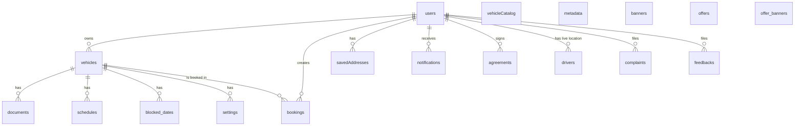

# 06 — Firestore Schema

Derived from `firestore.rules`, `firestore.indexes.json`, and the model classes in `lib/models/`. In test mode (`--dart-define=E2E_TEST_MODE=true`) all collection names are prefixed with `e2e_test_` — see `lib/core/constants/test_mode.dart`.

## Collection map

## `users/{uid}`

Source: `lib/models/user_model.dart`, `lib/services/auth_service.dart`.

| Field | Type | Notes |
|---|---|---|
| `userId` | string | mirror of doc id (sometimes denormalised) |
| `email` | string? | for email- or Google-auth users |
| `mobile` / `phoneNumber` | string? | reader normalises both keys |
| `fullName` | string? | reader normalises to `userName`; Google sign-in writes `fullName` |
| `profileImageUrl` | string? | Storage URL or Google profile photo |
| `authMethod` | string | `email` / `google` / `phone` |
| `role` | string? | `User` / `Driver` / `Vehicle Owner` (case-insensitive in `UserModel.isDriver`) |
| `isAdmin` | bool? | **Server-controlled only**. Rules block any client write that includes this key. |
| `verificationStatus` | string | `pending` (default) / `submitted` / `approved` / `rejected` |
| `verificationSubmittedAt` | Timestamp? | set when user submits docs |
| `verificationApprovedAt` | Timestamp? | set by admin |
| `verificationNotes` | string? | admin notes back to driver |
| `fcmToken` | string? | written by `NotificationService.saveFcmToken` |
| `fcmTokenUpdatedAt` | Timestamp? | bookkeeping |
| `drivingLicenseNumber` | string? | written by `VehicleService.updateUserLicenseDetails` |
| `drivingLicenseValidUpto` | Timestamp? | same |
| `isOnline` | bool? | driver-toggled; mirrors per-vehicle `isOnline` |
| `lastOnlineAt` | Timestamp? | server timestamp on online |
| `notificationCount`, `totalRides`, `rating` | int / int / double | metrics fields (currently denormalised, often 0/5.0 defaults) |
| `createdAt`, `lastLoginAt` | Timestamp | bookkeeping |

### Subcollection `users/{uid}/notifications/{notifId}`
| Field | Type |
|---|---|
| `title`, `body` | string |
| `type` | string (e.g. `RIDE_OTP`) |
| `data` | map |
| `isRead` | bool |
| `createdAt` | Timestamp |

Rules: created server-side only; client may toggle `isRead` and delete.

### Subcollection `users/{uid}/savedAddresses/{addressId}`
Source: `lib/models/saved_address_model.dart`, indexed as a **collection group** by `userId + createdAt`.

## `vehicles/{vehicleId}`

Source: `lib/services/vehicle_service.dart`, `lib/models/available_vehicle_model.dart`.

| Field | Type |
|---|---|
| `userId` | string — owner uid |
| `location` | map: `{ city, state, latitude, longitude, address }` |
| `vehicleDetails` | map: `{ type, brand, model, registrationNumber, color, seatingCapacity, hasAC, fuelType, transmission, year, ... }` |
| `documents` | map of arrays: `{ vehicleImages: [], rcImages: [], licenseImages: [], insuranceImages: [], pucImages: [] }` |
| `documentStatus` | string — `pending` / `approved` / `rejected` (admin-set) |
| `isOnline` | bool — driver-toggleable; **rules deny going online unless `documentStatus == 'approved'`** |
| `isAvailable` | bool — schedule-driven |
| `lastOnlineAt`, `onlineStatusUpdatedAt` | Timestamp |
| `pricing` | map: `{ basePrice, perKmRate, perHourRate, minimumFare }` |
| `driver` | map: `{ name, photoUrl, rating, ratingSum, ratingCount, totalTrips }` — incrementally maintained by `BookingService._updateDriverRating` |
| `createdAt` | Timestamp |

### Subcollections of `vehicles/{vehicleId}`

| Subcollection | Purpose | Owner-only writes |
|---|---|---|
| `documents/{docId}` | Document scan metadata | yes |
| `blocked_dates/{dateId}` | Calendar blocks | yes |
| `schedules/{scheduleId}` | Weekly schedule entries (`lib/models/weekly_schedule.dart`) | yes |
| `settings/{document=**}` | Availability/pricing presets | yes |

## `bookings/{bookingId}`

Source: `lib/models/booking_model.dart`, `lib/services/booking_service.dart`. Required keys at creation (enforced by rules `data.keys().hasAll([...])`): `userId, userPhone, userName, bookingType, status, pickupLocation, dropLocation, vehicle, driver, fareDetails, paymentMethod, paymentStatus, createdAt, updatedAt`.

| Field | Type | Notes |
|---|---|---|
| `userId`, `userName`, `userPhone` | string | rider snapshot |
| `bookingType` | enum string | `local` / `outstation` / `rental` / `goods` |
| `status` | enum string | `pending` / `confirmed` / `driverArriving` / `arrived` / `inProgress` / `completed` / `cancelled` / `rejected` / `expired` — **stored exactly as `BookingStatus.name`** (camelCase) |
| `vehicleId` | string | duplicated outside `vehicle.vehicleId` for query-time indexing |
| `pickupLocation`, `dropLocation` | map: `BookingLocation.toMap()` |
| `stops` | array of `BookingLocation` |
| `estimatedDistance` (km), `estimatedDuration` (minutes), `estimatedArrival` | num / num / string |
| `vehicle` | map: `BookingVehicleDetails.toMap()` — denormalised |
| `driver` | map: `BookingDriverDetails.toMap()` — denormalised; `driver.driverId` is the field used by the driver-side query and by Firestore rules |
| `fareDetails` | map: `FareDetails.toMap()` |
| `paymentMethod` | enum string | `cash` / `upi` / `card` / `wallet` / `netBanking` |
| `paymentStatus` | enum string | `pending` / `processing` / `completed` / `failed` / `refunded` / `partialRefund` |
| `paymentTransactionId` | string? |  |
| `scheduledAt`, `isScheduled` | Timestamp? / bool |  |
| `createdAt`, `confirmedAt`, `startedAt`, `completedAt`, `cancelledAt`, `updatedAt` | Timestamp |  |
| `cancellationReason`, `cancelledBy`, `cancellationFee` | string / string / double | `cancelledBy ∈ {user, driver}` |
| `userRating`, `userReview`, `driverRating`, `driverReview` | double / string |  |
| `amountReceived`, `remainingAmount`, `paymentReceivedAt`, `paymentReceivedBy`, `paymentRecordedManually` | double / double / Timestamp / string / bool | cash settlement |
| `rideOtp` | string | 6-digit, generated server-side at creation |
| `userNotes`, `driverNotes` | string? |  |

### Allowed updates by actor (per `firestore.rules`)

| Actor | Permitted fields |
|---|---|
| Rider (`userId` matches) | When status is `pending`/`confirmed`: `status, cancellationReason, cancelledBy, cancelledAt, cancellationFee, updatedAt, userRating, userReview`. After completion: only `userRating, userReview, updatedAt`. |
| Driver (`driver.driverId` matches), status ≠ `completed` | `status, confirmedAt, startedAt, completedAt, cancelledAt, cancellationReason, cancelledBy, fareDetails, estimatedDistance, estimatedDuration, driverRating, driverReview, updatedAt` |
| Driver, status == `completed` | `amountReceived, remainingAmount, paymentStatus, paymentReceivedAt, paymentReceivedBy, paymentRecordedManually, updatedAt` |
| Admin (`isAdmin == true`) | read + update everything |
| Anyone | delete: **denied** (`allow delete: if false`) |

## `drivers/{driverId}`

Source: `lib/services/live_location_service.dart`, `lib/models/driver_location_model.dart`. **Flat fields** to match rules exactly:

| Field | Type |
|---|---|
| `latitude`, `longitude` | double |
| `heading` | double |
| `speed` | double (km/h — converted from `Position.speed` m/s by `× 3.6`) |
| `isOnline` | bool |
| `lastUpdated` | Timestamp (server) |
| `currentBookingId` | string? — set on `startTracking`, deleted on `stopTracking` |

Rules: read only by the driver themselves, an admin, or the rider on the booking referenced by `currentBookingId`. Write only by the driver, restricted to the field set above.

## `vehicleCatalog/{document}`

Single seeded document `vehicleCatalog/india2025` written by the admin-only `seedVehicleCatalog` Cloud Function. Contains `colors`, `private`, `commercial` maps. Read by all clients (rules: `allow read: if true`).

## `metadata/{document}`

Single document `metadata/vehicleSearchMeta` containing `cities: [string]`, `vehicleTypes: [string]`, `updatedAt: Timestamp`. Incrementally updated by `VehicleService._updateSearchMeta` via `arrayUnion` on every successful vehicle registration. Rules restrict client writes to those exact keys; document creation and deletion are admin-only.

## `agreements/{uid}_{vehicleId}`

Source: `lib/screens/agreement_signing_screen.dart`. **Document ID format is critical** — `firestore.rules` ownership check is `agreementId.matches(request.auth.uid + '_.*')`. Required fields (rules):

| Field | Type |
|---|---|
| `userId` | must match `request.auth.uid` |
| `vehicleId` | string |
| `ownerName` | string |
| `vehicleRegistrationNumber` | string |
| `vehicleCategory` | string |
| `signatureData` | string (Base64-encoded signature image) |
| `agreedToTerms` | bool — must be `true` |
| `signedAt` | Timestamp |

Immutable: `allow update, delete: if false`.

## `banners/{bannerId}`, `offers/{offerId}`, `offer_banners/{offerBannerId}`

Marketing collections — read by all authenticated users, written only by admins.

- `banners`: `{ imageUrl, title, subtitle, ctaUrl, isActive, priority, createdAt }`
- `offers`: `{ code, discount, description, isActive, expiryDate }` (`code` is uppercased on lookup in `BookingService._getPromoDiscount`)
- `offer_banners`: similar to `banners`, surfaced via `OfferBannerSlider`

## `complaints/{complaintId}` and `feedbacks/{feedbackId}`

Created exclusively via Cloud Functions (`createComplaint`, `createFeedback`). Rules enforce schema and `userId == request.auth.uid` on direct writes (defence-in-depth).

| `complaints` field | Type |
|---|---|
| `ticketId` | string `ZY-YYYYMMDD-{nnn}` |
| `userId` | string |
| `subject`, `description` | string |
| `priority` | one of `Low` / `Medium` / `High` |
| `status` | enum, starts `Pending` |
| `imageUrl` | string? |
| `createdAt` | server Timestamp |

| `feedbacks` field | Type |
|---|---|
| `feedbackId` | string `FB-YYYYMMDD-{nnn}` |
| `userId` | string |
| `rating` | number 1–5 |
| `message` | string |
| `imageUrl` | string? |
| `createdAt` | server Timestamp |

## Composite indexes (from `firestore.indexes.json`)

| Collection | Fields | Purpose |
|---|---|---|
| `bookings` | `userId ↑, status ↑, createdAt ↓` | active booking lookup by user |
| `bookings` | `userId ↑, createdAt ↓` | user ride history |
| `bookings` | `userId ↑, bookingType ↑, createdAt ↓` | filtered history |
| `bookings` | `driver.driverId ↑, status ↑, createdAt ↓` | driver pending requests |
| `bookings` | `driver.driverId ↑, createdAt ↓` | driver history |
| `bookings` | `status ↑, vehicleId ↑, bookingDate ↑` | availability conflict checks |
| `bookings` | `vehicleId ↑, startDate ↑` | rental conflict checks |
| `vehicles` | `location.city ↑, isAvailable ↑, createdAt ↓` | city + available |
| `vehicles` | `location.city ↑, vehicleDetails.type ↑, isAvailable ↑` | city + type + available |
| `vehicles` | `userId ↑, createdAt ↓` | my vehicles |
| `vehicles` | `isOnline ↑, location.city ↑` | online drivers by city |
| `vehicles` | `isOnline ↑, location.city ↑, vehicleDetails.type ↑` | online + city + type |
| `vehicles` | `isOnline ↑, vehicleDetails.type ↑` | online + type |
| `vehicles` | `userId ↑, documentStatus ↑` | owner verification list |
| `vehicles` | `isAvailable ↑, createdAt ↓` | global available list |
| `vehicles` | `isAvailable ↑, vehicleDetails.type ↑, createdAt ↓` | type-filtered availability |
| `users` | `verificationStatus ↑, createdAt ↓` | admin queue |
| `offers` | `code ↑, isActive ↑` | promo lookup |
| `offers` | `isActive ↑, expiryDate ↑` | active offers feed |
| `feedbacks` | `userId ↑, createdAt ↓` | my feedback |
| `complaints` | `userId ↑, createdAt ↓` | my tickets |
| `banners` | `isActive ↑, priority ↓` | banner feed |
| `offer_banners` | `isActive ↑, priority ↓` | offer banner feed |
| `savedAddresses` (collection group) | `userId ↑, createdAt ↓` | per-user addresses |

`fieldOverrides`: `bookings.status` has both `ASCENDING` and `ARRAY_CONTAINS` configs to support `whereIn` queries used by `BookingService.getActiveBookingStream`.
