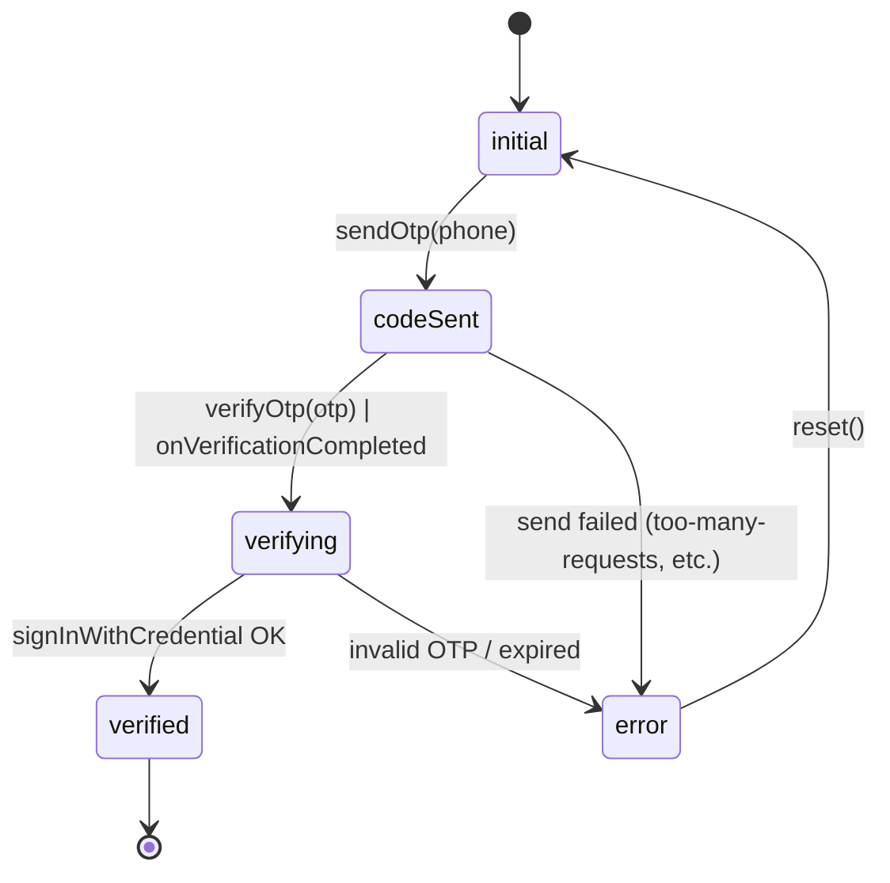

# 07 — Authentication & Authorization

## Authentication methods

All three Firebase Auth flows are implemented in `lib/services/auth_service.dart` and wired through dedicated screens.

| Method | Screen(s) | Service method | New-user side effect |
|---|---|---|---|
| Email + password (register) | `RegisterScreen` (`/registration`) | `registerWithEmail` | duplicate-mobile guard → `createUserWithEmailAndPassword` → `_createUserDocument(authMethod: 'email')` → `EmailVerificationScreen` |
| Email + password (login) | `LoginScreen` (`/login`) | `signInWithEmail` | updates `lastLoginAt` only |
| Google Sign-In | `LoginScreen` (Google button) | `signInWithGoogle` | `_createOrUpdateUserDocument(authMethod: 'google')` — pulls displayName, email, photoURL |
| Phone + OTP | `PhoneAuthScreen` (`/phone-auth`) → inline `VerifyOtpScreen` | `verifyPhoneNumber` + `signInWithPhoneCredential` | `_createOrUpdateUserDocument(authMethod: 'phone')` |
| Password reset | `ForgotPasswordScreen` (`/forgot-password`) | `sendPasswordResetEmail` | Firebase Auth-managed email |
| Email verification | `EmailVerificationScreen` (`/email-verification`) | `sendEmailVerification`, `checkEmailVerified` | polls `auth.currentUser.reload()` |

### Phone authentication state machine

`PhoneAuthNotifier` (`lib/services/auth_service.dart`) — `StateNotifier<PhoneAuthState>` with status enum `initial → codeSent → verifying → verified | error`. Auto-verification path is handled separately (Android auto-retrieves the SMS; `onVerificationCompleted` is fired with the credential, which the notifier signs in immediately).

Resend uses `resendToken` carried in the state — passed back through `forceResendingToken` on subsequent `verifyPhoneNumber` calls.

### Google Sign-In setup

Uses `google_sign_in: ^6.2.1` with scopes `['email', 'profile']`. The Android setup (SHA-1 / SHA-256 fingerprints in Firebase Console) is implicit — there's no per-environment config in code beyond `google-services.json`. Web client OAuth ID is not configured; web is not a supported target.

## Post-login routing

After successful auth, the client reads `users/{uid}.role` via `AuthService.getUserRole(uid)`:

| `role` value | Route |
|---|---|
| `User` / `user` / `null` (legacy) | `/user-dashboard` |
| `Driver` / `driver` / `Vehicle Owner` / `owner` | `/dashboard` (`MainDashboard`) |

Brand-new users (no `role`) are redirected to `RoleSelectionScreen` (`/role-selection?userId=`) which writes the chosen role and continues.

## Session & sign-out

- Session lifetime is managed by Firebase Auth (refresh tokens persisted by the SDK).
- `AuthService.signOut()` clears Google SDK state first (`_googleSignIn.signOut()`) then calls `auth.signOut()`. Callers should also call `NotificationService.removeFcmToken(uid)` and the topic-unsubscribe helpers (`unsubscribeAsUser` / `unsubscribeAsDriver`) before logging out, so the user stops receiving notifications.

## Authorization model (server-enforced)

Two layers stack: **client-side** UI gating (`verification_provider.dart`, `DriverOnlineToggle`) and **server-side** rules (`firestore.rules`). Server-side is the only one that is trustworthy.

### Identity claims used by rules

| Claim | Source |
|---|---|
| `request.auth.uid` | Firebase Auth |
| `users/{uid}.isAdmin == true` | Server-controlled flag; client writes that include `isAdmin` are explicitly rejected on both create and update. |
| `users/{uid}.verificationStatus == 'approved'` | Set only by an admin write or Cloud Function. Driver client can advance from `pending`/`rejected` → `submitted` only. |
| `vehicles/{vehicleId}.userId == request.auth.uid` | Vehicle ownership |
| `vehicles/{vehicleId}.documentStatus == 'approved'` | Per-vehicle approval gate for going online |

### Per-collection authorization summary

| Collection | Read | Create | Update | Delete |
|---|---|---|---|---|
| `users/{uid}` | owner or admin | owner; cannot self-assign `isAdmin`; `verificationStatus` defaults to `pending` | owner; cannot escalate `isAdmin`; can only flip `verificationStatus` from `pending`/`rejected` → `submitted` | (admin only — implicit) |
| `users/{uid}/notifications/{id}` | owner | server-only (`if false`) | owner; only `isRead` flips | owner |
| `users/{uid}/savedAddresses/{id}` | owner | owner | owner | owner |
| `vehicles/{id}` | any authenticated user | creator must be owner | owner — but going online requires `documentStatus == 'approved'` (server checks `resource.data.documentStatus`); admin can also update | owner; admin |
| `vehicles/{id}/{documents,blocked_dates,schedules,settings}` | any authenticated user | owner of parent vehicle | owner | owner |
| `bookings/{id}` | rider, driver, vehicle owner, or admin | rider; required-key + `userId == auth.uid` + `status == 'pending'` | per-actor field whitelists (see [06](06-firestore-schema.md)) | denied |
| `drivers/{driverId}` | driver self, admin, or rider on the active booking | driver self | driver self; only `latitude, longitude, heading, speed, isOnline, lastUpdated, currentBookingId` | denied |
| `vehicleCatalog/{doc}` | public read | denied (admin-only via function) | denied | denied |
| `metadata/{doc}` | any auth | denied (admin/backend only) | any auth, only `cities, vehicleTypes, updatedAt` keys | denied |
| `banners`, `offers`, `offer_banners` | any auth | admin | admin | admin |
| `agreements/{uid_vehicleId}` | owner (id-prefix match) | owner + schema match + `agreedToTerms == true` | denied | denied |
| `complaints/{id}` | owner or admin | authenticated; schema + `userId == auth.uid` + `status == 'Pending'` | admin only | denied |
| `feedbacks/{id}` | owner or admin | authenticated; schema + 1–5 rating + `userId == auth.uid` | denied | denied |

### Defence-in-depth highlights

1. **Privilege-escalation guard** — `!('isAdmin' in request.resource.data.diff(resource.data).affectedKeys())`. Even an admin who is also using the mobile client cannot accidentally flip `isAdmin` from the app.
2. **Verification-status state machine** on the client write — server allows only the `pending|rejected → submitted` transition; `approved` and `rejected` can only come from the admin panel.
3. **Driver-online gate** — `(!isGoingOnline() || resource.data.documentStatus == 'approved')`. Checking `resource.data` rather than `request.resource.data` means the rule reads the *existing* doc's `documentStatus`, preventing a client from sneaking `documentStatus: 'approved'` into the same write.
4. **Completed-booking lock** — once `status == 'completed'`, the driver can only touch payment-receipt fields. Fare cannot be edited post-trip.
5. **Driver-location stalking guard** — reads on `drivers/{driverId}` require that the caller is the driver themselves, an admin, or the rider on the booking referenced by `currentBookingId`. Random user IDs cannot watch any driver's GPS.
6. **Agreement immutability** — `allow update, delete: if false` on `agreements/*`. Signed terms cannot be tampered with.
7. **No client deletes on bookings** — cancellation is a status update, preserving an audit trail.

## App Check

App Check provides device-attestation tokens that Firebase backends can require. The client unconditionally activates the provider in `main.dart` (Play Integrity on release Android, App Attest on release iOS, debug provider otherwise). To start enforcing it on Firestore/Storage/Functions, toggle "enforce" in the Firebase Console — the client is already ready.

## Email verification policy

`RegisterScreen` flow routes through `EmailVerificationScreen` after sign-up. `AuthService.checkEmailVerified` reloads the user and reads `auth.currentUser.emailVerified`. Note: there is **no gate in code that blocks an unverified email user from reaching the rest of the app** — once registered, a user can hit `Skip` and continue. If email verification is required for production, add a `redirect` rule in `router.dart` based on `auth.currentUser?.emailVerified` plus auth method.
