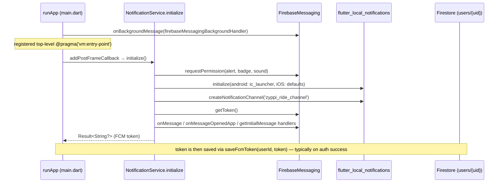
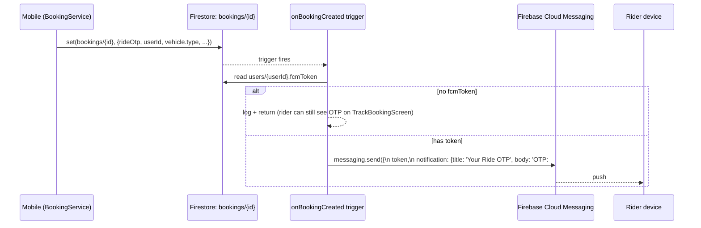

# 08 — Push Notification Architecture

## Stack

| Layer | Package |
|---|---|
| Cloud transport | Firebase Cloud Messaging (FCM) — `firebase_messaging: ^16.1.1` |
| In-app foreground display | `flutter_local_notifications: ^18.0.0` |
| Server-side sending | `firebase-admin` (in Cloud Functions, `functions/index.js`) |

The runtime implementation lives in `lib/services/notification_service.dart` and the only production sender is the `onBookingCreated` Cloud Function (`functions/index.js`).

## Initialisation flow



Permission is requested at first init. On Android 13+ the `POST_NOTIFICATIONS` runtime permission is required and is satisfied by `FirebaseMessaging.requestPermission`.

## Token lifecycle

| Event | Handling |
|---|---|
| First init | `getToken()` returns the device token; caller persists it via `NotificationService.saveFcmToken(uid, token)` to `users/{uid}.fcmToken`. |
| Refresh | `onTokenRefresh` listener (caller registers) — write the new token to Firestore. |
| Sign-out | `removeFcmToken(uid)` deletes `fcmToken` and `fcmTokenUpdatedAt` (only if the user doc exists). |

## Channels

Android: `zyppi_ride_channel`, importance `high`, sound + vibration enabled. iOS: alert + badge + sound enabled by default at init.

## Topic taxonomy

| Topic | Subscribed by |
|---|---|
| `all_users` | both roles on login |
| `users` | rider role on login |
| `drivers` | driver role on login |
| `user_{userId}` | rider role on login |
| `driver_{userId}` | driver role on login |

Methods: `subscribeAsUser(userId)`, `subscribeAsDriver(userId)` and corresponding `unsubscribe*`.

## Foreground vs background handling

```mermaid
flowchart LR
  FCM --> AppState{App state}
  AppState -- foreground --> OnMessage[_handleForegroundMessage] --> ShowLocal[showLocalNotification\n via flutter_local_notifications]
  AppState -- background --> System[System tray]
  System -- tap --> Opened[_handleNotificationTap] --> CB[onNotificationTap callback\n(if set)]
  AppState -- terminated --> InitialMsg[getInitialMessage] --> Opened
```

The optional `onNotificationTap` callback on `NotificationService` lets a higher-level component (e.g. a navigator listener) route based on the payload — for example, jumping to `/track-booking` on a `RIDE_OTP` push.

## Payload encoding for local notifications

The foreground path round-trips `RemoteMessage.data` through a `key=value&key=value` string passed via the `payload` parameter (`_encodePayload`/`_decodePayload`). The decoder uses `indexOf('=')` so values containing `=` (URLs, base64) survive intact.

## Cloud Function — OTP push on booking creation

Source: `functions/index.js`.



Failure mode is graceful: missing token → silent no-op. The OTP is *also* visible on the `TrackBookingScreen` in-app, so the user always has access.

## What is NOT currently implemented

These are deliberate gaps to flag, not bugs:

- **Driver-side push for new ride requests.** No Cloud Function currently fires to assigned drivers when a booking is created. The driver dashboard relies on a Firestore live snapshot of pending bookings to surface requests (`BookingService.getDriverPendingBookingsStream`).
- **Status-change pushes** (driver-arriving, trip-started, trip-completed). No server triggers exist for these.
- **Topic-based marketing campaigns** are wired (the topics exist), but no sending infrastructure (admin tool / function) is in the repo.

## Diagnostics

In debug builds, `main.dart` calls `FirebaseAppCheck.instance.getToken(true)` once and logs a brief OK/failure line so developers can see whether App Check is yielding a valid token (FCM does **not** depend on App Check, but Firestore reads from a misconfigured device will fail with permission errors that are sometimes misread as auth issues).

To verify push end-to-end:
1. Sign in on a physical device (FCM does not run on iOS simulator).
2. Confirm `users/{uid}.fcmToken` populates in Firestore.
3. Create a booking; observe the OTP toast / system tray within a few seconds.
4. Use the Firebase Console "Cloud Messaging → Send test message" form, paste the token, and confirm receipt.
