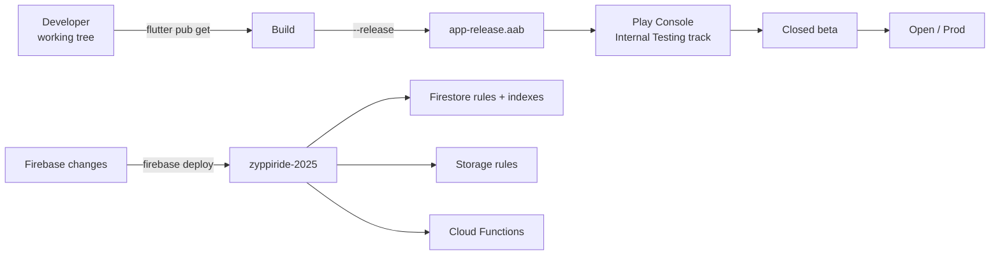

# 12 — Deployment Guide

## Targets

| Platform | Status | Artefact |
|---|---|---|
| **Android (Play Store)** | Primary | `app-release.aab` |
| **Android sideload / QA** | Supported | `app-release.apk` |
| **iOS App Store** | Scaffolded; not configured in this repo (no Apple signing assets) | `.ipa` via `flutter build ipa` |
| **Web / macOS / Windows / Linux** | `flutter create` scaffolding only — not a supported delivery target | — |

## One-off setup (per environment)

### Firebase project
- Project ID: `zyppiride-2025` (in `.firebaserc`).
- Enable in console: Authentication (Email, Google, Phone), Firestore, Storage, Cloud Messaging, App Check, Analytics.
- Run once on a dev machine:
  ```bash
  npm install -g firebase-tools
  firebase login
  firebase use zyppiride-2025
  ```

### Android signing (one-off, before first Play Store upload)

1. Generate an upload keystore:
   ```bash
   keytool -genkey -v -keystore ~/keystores/zyppiride-upload.jks \
     -keyalg RSA -keysize 2048 -validity 10000 \
     -alias zyppiride
   ```
2. Create `android/key.properties` (**do not commit**):
   ```properties
   storePassword=<store password>
   keyPassword=<key password>
   keyAlias=zyppiride
   storeFile=/Users/<you>/keystores/zyppiride-upload.jks
   ```
3. Update `android/app/build.gradle.kts`:
   ```kotlin
   val keystoreProperties = Properties()
   val keystorePropertiesFile = rootProject.file("key.properties")
   if (keystorePropertiesFile.exists()) {
     keystoreProperties.load(FileInputStream(keystorePropertiesFile))
   }

   android {
     signingConfigs {
       create("release") {
         storeFile = file(keystoreProperties["storeFile"] as String)
         storePassword = keystoreProperties["storePassword"] as String
         keyAlias = keystoreProperties["keyAlias"] as String
         keyPassword = keystoreProperties["keyPassword"] as String
       }
     }
     buildTypes {
       getByName("release") {
         signingConfig = signingConfigs.getByName("release")  // not "debug"!
         // existing proguard etc.
       }
     }
   }
   ```
4. Register the **upload certificate's SHA-1 / SHA-256** in Firebase Console → Project Settings → Your apps → Add fingerprint (required for Google Sign-In and dynamic links).

### Firebase App Check (production)

- **Android (Play Integrity)** — enable Play Integrity API in Google Cloud Console for `com.zyppiride.app`. Register the Play Integrity provider in Firebase Console.
- **iOS (App Attest)** — Add the App Attest capability in Apple Developer Console; iOS 14+ only.
- After confirming a clean release build attests successfully, toggle **Enforce** in Firebase Console for Firestore, Storage, and Cloud Functions.

## Release pipeline



### Mobile build commands

```bash
# Sanity checks (run locally before every release)
flutter pub get
flutter analyze
flutter test
flutter test integration_test/    # E2E suite — needs --dart-define=E2E_TEST_MODE=true configured

# Production AAB (Play Store)
flutter build appbundle --release \
  --build-name=$(yq -r .version pubspec.yaml | cut -d+ -f1) \
  --build-number=$(yq -r .version pubspec.yaml | cut -d+ -f2)

# Production APK (QA sideload)
flutter build apk --release

# Mock-mode debug build (for QA testing without polluting prod collections)
flutter run --dart-define=E2E_TEST_MODE=true
```

### Firebase deploy commands

```bash
# Full deploy
firebase deploy

# Targeted deploys
firebase deploy --only firestore:rules,firestore:indexes
firebase deploy --only storage
firebase deploy --only functions
firebase deploy --only functions:onBookingCreated
```

The functions predeploy hook runs `npm --prefix functions run lint`. If lint fails, the deploy aborts. Do **not** use `--force` to bypass.

## Versioning

- `pubspec.yaml` `version: 1.0.0+1` → Android `versionName = 1.0.0`, `versionCode = 1`.
- Bump the `+N` build number on every uploaded AAB (Play Console will reject duplicate version codes).
- Tag the corresponding git commit `v1.0.X` for traceability.

## Rollback plan

| Subsystem | Rollback |
|---|---|
| Cloud Functions | `firebase functions:log` to confirm regression; `git revert <commit>` and re-deploy. |
| Firestore rules | `firebase deploy --only firestore:rules` with the previous rules file (kept in git). The console also retains the last deployed version under "Rules → History". |
| Firestore indexes | Indexes don't break old queries — you can let new indexes coexist. To remove an index, edit `firestore.indexes.json` and re-deploy. |
| Mobile app | Halt rollout in Play Console → previous version remains the latest auto-update. Plan a forward fix; do not delete the broken AAB. |

## Post-deploy verification checklist

- [ ] App opens past `SplashScreen` without `_FirebaseErrorApp` showing.
- [ ] FCM token populates on `users/{uid}.fcmToken` after sign-in.
- [ ] Creating a booking triggers an OTP push within ~5 s.
- [ ] Driver can toggle `isOnline` only after admin approves both `users/{uid}.verificationStatus` and `vehicles/{id}.documentStatus`.
- [ ] Live location updates land on `drivers/{driverId}` and stream to the rider's `TrackBookingScreen`.
- [ ] Support ticket submission generates an ID matching `ZY-YYYYMMDD-XXX`.

## Common deploy pitfalls

| Symptom | Likely cause |
|---|---|
| `App Check token failed` in console | The release build is using the debug provider, or Play Integrity API is not enabled in GCP, or the package signing fingerprint doesn't match. |
| Google Sign-In silently fails | SHA-1 / SHA-256 not registered for the upload-key in Firebase Console. |
| Pushed OTP never arrives | `users/{uid}.fcmToken` empty (notification permission not granted), or device under battery-saver. Fall back to in-app OTP on `TrackBookingScreen`. |
| Cloud Function logs `PERMISSION_DENIED` | The service account is missing IAM roles. Re-grant `roles/datastore.user` and `roles/cloudmessaging.sender`. |
| `flutter build appbundle` succeeds but Play Store rejects | Most often: signed with debug keystore (see S-01). |
