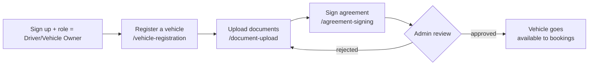
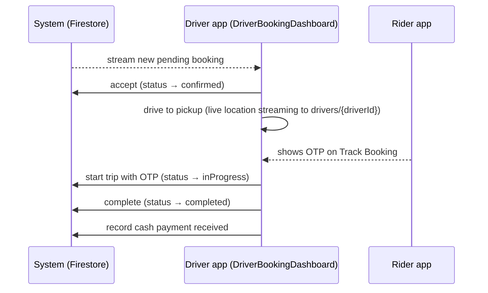

# 16 — Admin & Driver Operational Manual

The Zyppi Ride mobile app has **two operator-style roles**: drivers (who self-manage their fleet) and admins (who operate via a separately maintained **web** admin panel — referenced in the rules but not part of this Flutter repository). This document covers both.

## Driver / Vehicle Owner

### Onboarding

#### Step 1 — Register a vehicle (`/vehicle-registration`)

Fields collected (`vehicle_registration_screen.dart`, surfaced as `vehicleDetails`):
- Vehicle type (car / SUV / mini-truck / bike / etc.), brand, model, year, color, fuel type, transmission, seating capacity, AC, registration number, license plate (validated by `vehicle_number_formatter.dart`).
- Location (city, state, lat/lng) — uses GPS + address autocomplete.
- 1+ vehicle images (uploaded to `vehicles/{userId}/vehicle/{ts}.jpg`, capped 5 MB each).

#### Step 2 — Upload documents (`/document-upload`)

Required documents (stored under `vehicles/{vehicleId}/documents` and `vehicles/{vehicleId}.documents`):
- RC (Registration Certificate)
- Driving license
- Insurance certificate
- PUC (Pollution Under Control)
- Vehicle photos (already uploaded in step 1)

After upload, `verificationStatus` on the user advances from `pending` to `submitted` (the only client-allowed transition).

#### Step 3 — Sign agreement (`/agreement-signing`)

The agreement screen uses `signature: ^6.3.0`. The signature is captured as a base64 image and stored alongside owner / vehicle data in `agreements/{uid}_{vehicleId}`. **The document ID format is fixed** — server rules require `agreementId.matches(uid + '_.*')`. Agreements are immutable after signing.

#### Step 4 — Admin review

The admin (via the web panel) reviews the submission, sets `users/{uid}.verificationStatus = 'approved'` (or `rejected`) and per-vehicle `vehicles/{id}.documentStatus = 'approved'`. The driver dashboard listens to these via `verification_provider.dart` and unlocks the online toggle once both are approved.

### Going online (`DriverOnlineToggle`)

Source: `lib/widgets/driver/driver_online_toggle.dart`.

The toggle is disabled until **all** of the following are true:
- `users/{uid}.verificationStatus == 'approved'`
- At least one of the driver's vehicles has `documentStatus == 'approved'`
- An active signed agreement exists for that vehicle

The same gate is enforced by `firestore.rules` on the vehicle update — bypassing the client UI does not help; the server will reject the write.

Flipping the toggle calls `DriverStatusService.toggleOnlineStatus({userId, isOnline})`, which batch-updates `isOnline` on every vehicle the driver owns plus the user document.

### Managing schedules and availability

- **Weekly schedule** (`/manage-schedule?vehicleId=`) — opens `WeeklyScheduleScreen`. Models in `lib/models/weekly_schedule.dart`. Each day has working windows and toggle.
- **Driver availability calendar** (`/driver-availability?vehicleId=`) — `DriverAvailabilityScreen`. Add ad-hoc blocked dates (vacation, maintenance). Backed by `vehicles/{id}/blocked_dates/{dateId}`.
- **Settings** (vehicle preferences, trip preferences) — `lib/widgets/trip_preferences_section.dart`, `lib/widgets/vehicle_preferences_section.dart`, persisted under `vehicles/{id}/settings/...`.

### Accepting and running a trip

| Action | Service call | Status |
|---|---|---|
| Accept request | `BookingService.acceptBooking(id, driverId)` | `pending → confirmed` |
| Reject request | `BookingService.rejectBooking(id, driverId, reason)` | `pending → rejected` |
| Arrive at pickup | `BookingService.driverArrived(id, driverId)` | `confirmed → arrived` |
| Start trip (with OTP) | `BookingService.startTrip(id, driverId, otp)` | `arrived → inProgress` (rejected if OTP wrong) |
| Complete trip | `BookingService.completeTrip(id, driverId, …)` | `inProgress → completed`; fare recalculated if actuals differ |
| Record cash | `BookingService.recordPaymentReceived({id, driverId, amount})` | `paymentStatus → completed` when remaining == 0 |
| Rate rider | `BookingService.addDriverRating(id, driverId, rating)` | optional |

### Earnings

Driver earnings = `totalFare − 5 %` platform fee (`FareCalculator.calculateDriverEarnings`). Surfaced on `DriverStatsCard` and within the booking history view.

### Notifications

Drivers are subscribed to `all_users`, `drivers`, and `driver_{userId}` FCM topics on login. The current Cloud Function set does not push new-booking notifications to drivers — the dashboard relies on a live Firestore stream of pending requests. To add driver pushes, write a Firestore-triggered Cloud Function on `bookings/{id}` create that looks up `driver.driverId` → `users/{driverId}.fcmToken`.

## Admin (web panel — out of this repo)

The web admin panel is a separate codebase. The mobile app and rules reference admin actions through the `isAdmin` flag on `users/{uid}`.

### Admin privilege model

- `isAdmin: true` on the user document grants full read on `bookings`, `complaints`, `feedbacks`, and write on `vehicles`, `banners`, `offers`, `offer_banners`.
- **Admins are made manually**, by an existing admin running an out-of-band script (e.g. `functions/adminkeyypdate.js` referenced in the repo, or a direct Firestore console write). **Clients cannot self-elevate** — `firestore.rules` blocks any client write that includes `isAdmin`.

### Admin responsibilities

| Task | Where in Firestore | UI |
|---|---|---|
| Approve / reject driver verification | `users/{uid}.verificationStatus` | Verification queue, sorted by `verificationStatus + createdAt` (composite index exists) |
| Approve / reject vehicle documents | `vehicles/{id}.documentStatus` | Vehicle review queue |
| Manage banners | `banners/*` | Banner CMS |
| Manage offer codes | `offers/*` | Offer CMS |
| Triage support tickets | `complaints/*`, `feedbacks/*` | Support inbox |
| Adjust completed-trip fare (rare) | `bookings/{id}.fareDetails` | Only admins can do this — driver rules forbid post-completion fare edits |
| Seed vehicle catalog | invoke `seedVehicleCatalog` HTTPS function | `POST /seedVehicleCatalog` with admin Bearer token |
| Issue refunds | `bookings/{id}.paymentStatus = refunded` | Admin-only update |

### Operational scripts in `functions/`

| Script | Purpose | How to run |
|---|---|---|
| `adminkeyypdate.js` | Admin key / flag updates | `node functions/adminkeyypdate.js` (requires Admin SDK credentials) |
| `updateAllUsers.js` | Bulk-rewrite user fields (e.g. schema migrations) | `node functions/updateAllUsers.js` |
| `getFirestoreStructure.js` | Dump structure for inspection | `node functions/getFirestoreStructure.js` |
| `seedVehicleCatalog` (HTTPS function) | Seed the world-readable vehicle catalog | `curl -X POST -H "Authorization: Bearer <admin idToken>" <url>` |

> Operational scripts that use the Admin SDK need a service-account key on disk. Use Application Default Credentials (`gcloud auth application-default login`) rather than downloading a key file — and **never commit a key**. See incident note in [11](11-security-audit-report.md).

### Admin monitoring playbook

- **Booking volume** — Firestore Console → bookings collection, sorted by `createdAt`.
- **Stale pending bookings** — query bookings with `status == 'pending'` older than 10 min; consider scheduling `expireOldBookings` as a daily Cloud Function (today it's a client method that no-ops without `adminOverride: true`).
- **Driver fleet health** — `users` filtered by `verificationStatus == 'submitted'` (queue length).
- **Support inbox** — `complaints` ordered by `createdAt` desc with `status == 'Pending'`.

### Onboarding a new admin

1. Existing admin: open Firestore Console → `users/{uid}` of the user to elevate.
2. Add field `isAdmin: true` (boolean).
3. New admin logs into the web admin panel.
4. Audit: keep a list of who has `isAdmin: true` and review quarterly. There is no built-in admin-action audit trail in this codebase — consider adding a Cloud Function trigger on `users.isAdmin` changes that writes to an immutable `admin_audit` collection.
