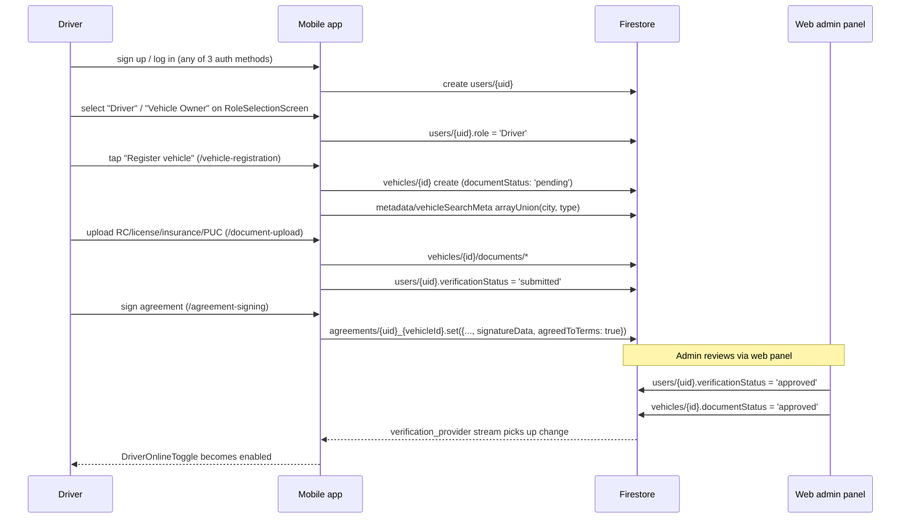
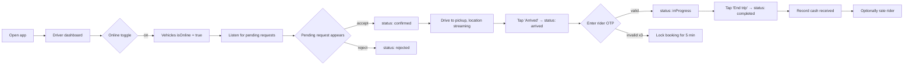
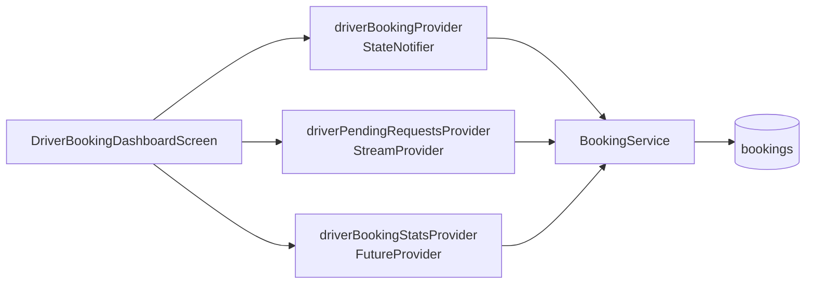

# 19 — Driver App Flow Documentation

End-to-end view of the **driver / vehicle-owner** experience inside the same Flutter binary that serves riders. The post-login route is selected from `users/{uid}.role` (`AuthService.getUserRole`); `Driver`, `driver`, `Vehicle Owner`, and `owner` all route into the driver experience (`UserModel.isDriver`).

## Top-level driver navigation map

```mermaid
flowchart TB
  Splash[/splash/] --> Login[/login/]
  Login --> RoleSel[/role-selection/ — first time only]
  RoleSel --> Home[/dashboard/ — MainDashboard]
  Login --> Home

  Home --> Bookings[/driver-booking-dashboard/]
  Home --> Vehicles[/vehicle-list/]
  Home --> Profile[/driver-profile/]
  Home --> Avail[/availability/]
  Home --> Active[/active-vehicles/]
  Home --> Delivery[/delivery-requests/]
  Home --> Notif[/notifications/]
  Home --> Support[/support-center/]

  Vehicles --> Reg[/vehicle-registration/]
  Vehicles --> View[/vehicle-view?vehicleId=/]
  View --> Edit[/vehicle-edit?vehicleId=/]
  View --> Docs[/document-upload?vehicleId=/]
  View --> Agree[/agreement-signing?vehicleId=/]
  View --> Sched[/manage-schedule?vehicleId=/]
  View --> DAvail[/driver-availability?vehicleId=/]
```

## Onboarding flow (first-time driver)



**Server-enforced gate**: `firestore.rules` blocks any `vehicles/{id}.isOnline = true` write unless the existing `resource.data.documentStatus == 'approved'`. The client UI is just the friendly mirror.

## Daily driver workflow (already-onboarded)



## Screen catalogue (driver-side)

| Screen | Route | Key widgets / providers |
|---|---|---|
| Main dashboard | `/dashboard` | `MainDashboard` — summary, online toggle, quick links |
| Booking dashboard | `/driver-booking-dashboard` | `DriverBookingDashboardScreen` — pending requests, active ride, stats. Watches `driverBookingProvider`, `driverPendingRequestsProvider`, `driverBookingStatsProvider`. |
| Vehicle list | `/vehicle-list` | `VehicleListScreen` — owner's fleet |
| Vehicle registration | `/vehicle-registration` | `VehicleRegistrationScreen` — multi-step wizard backed by `VehicleService.registerVehicle` |
| Vehicle view | `/vehicle-view?vehicleId=` | `VehicleViewScreen` — read-only detail + edit/docs/agreement/sched links |
| Vehicle edit | `/vehicle-edit?vehicleId=` | `VehicleEditScreen` |
| Document upload | `/document-upload?vehicleId=` | `DocumentUploadScreen` — uses `image_picker`, `flutter_image_compress`, Storage |
| Agreement signing | `/agreement-signing?vehicleId=` | `AgreementSigningScreen` — `signature: ^6.3.0` capture |
| Weekly schedule | `/manage-schedule?vehicleId=` | `WeeklyScheduleScreen` + `schedule_provider` |
| Driver availability | `/driver-availability?vehicleId=` | `DriverAvailabilityScreen` + `availability_provider` |
| Active vehicles | `/active-vehicles` | `ActiveVehiclesScreen` — currently-online fleet view |
| Delivery requests | `/delivery-requests` | `DeliveryRequestsScreen` — goods-carrier specific queue |
| Driver profile | `/driver-profile` | `DriverProfileScreen` — verification status, license details |
| Ride history (driver) | `/ride-history` | `RideHistoryScreen` |
| Notifications | `/notifications` | `NotificationsScreen` reads `users/{uid}/notifications` subcollection |
| Support center | `/support-center` | `SupportCenterScreen` |

## OTP brute-force protection (client-side)

Source: `DriverBookingDashboardScreen` state — `_maxOtpAttempts = 3`, `_lockoutMinutes = 5`, with `_otpFailedAttempts` and `_otpLockedUntil` maps keyed by booking ID.

| Attempt | Outcome |
|---|---|
| 1, 2 | "Invalid OTP" snackbar; counter increments |
| 3 | Booking locked for 5 minutes; OTP entry disabled with countdown |

The same protection should ideally live server-side as well (see [F-02 in 18-future-enhancements](18-future-enhancements.md)) — a determined driver client could bypass the local counters.

## Notification subscriptions

On entry to `DriverBookingDashboardScreen`, `notificationProvider.notifier.subscribeAsDriver(uid)` is called, registering the driver to FCM topics `all_users`, `drivers`, and `driver_{uid}`. On sign-out the matching `unsubscribeAsDriver` must be called (see [F-12 in 18-future-enhancements](18-future-enhancements.md) — sign-out cleanup is currently incomplete).

## Provider wiring on the dashboard



## Stats computed for the driver

`BookingService.getDriverStats(driverId)` returns `BookingStats`:
- `totalBookings`
- `completedBookings`
- `cancelledBookings`
- `totalSpent` — repurposed as **total earned** for the driver side (gross fare summed)
- `totalDistance`
- `completionRate` (derived)

Today this query reads **every completed booking** for the driver. At scale, switch to a counter doc updated via Cloud Function (see [F-09](18-future-enhancements.md)).

## Earnings model

Per-trip earnings = `totalFare × (1 − 0.05)` (5 % platform fee), via `FareCalculator.calculateDriverEarnings`. Cash settlement is recorded via `BookingService.recordPaymentReceived` and writes the `amountReceived`, `remainingAmount`, `paymentReceivedAt`, `paymentReceivedBy`, `paymentRecordedManually: true` fields.

## Driver-side data writes summary

| Action | Target | Allowed by rule |
|---|---|---|
| Toggle `isOnline` | `vehicles/{id}` | yes, if `documentStatus == 'approved'` |
| Update live location | `drivers/{uid}` | yes, only the listed fields |
| Accept booking | `bookings/{id}` | yes, status whitelist |
| Reject booking | `bookings/{id}` | yes, status whitelist |
| Record cash payment | `bookings/{id}` (post-completion) | yes, restricted to receipt fields |
| Update vehicle details | `vehicles/{id}` | yes, owner-only |
| Upload signature & sign agreement | `agreements/{uid_vehicleId}` | yes, immutable after creation |
| Upload documents | Storage `vehicles/{userId}/...` | yes, 5 MB / `image/*` cap |
