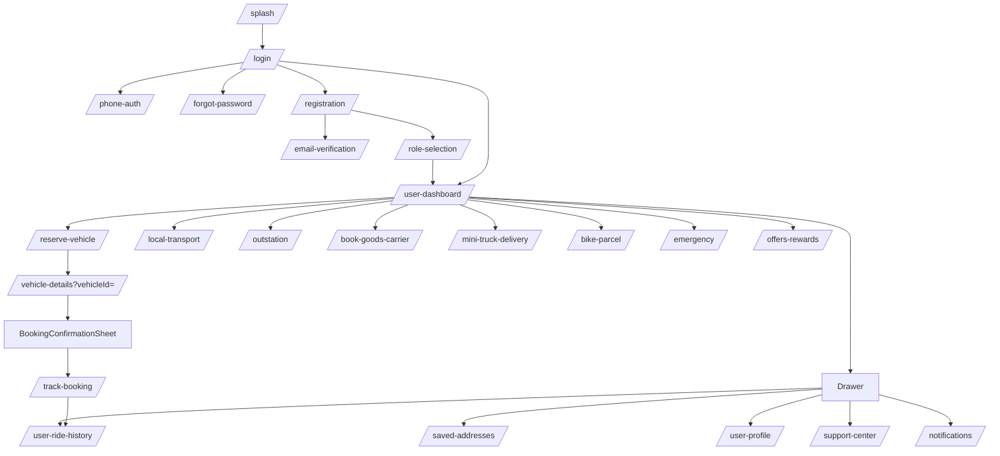
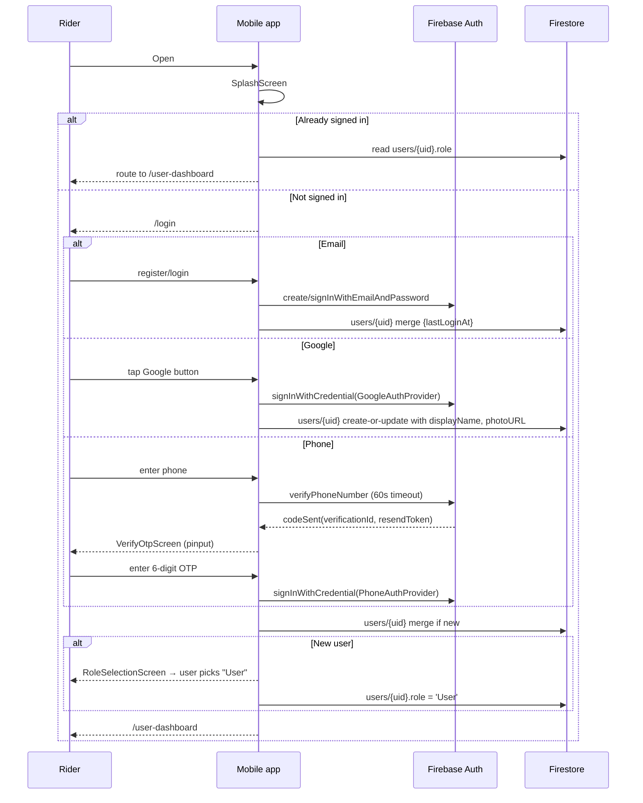
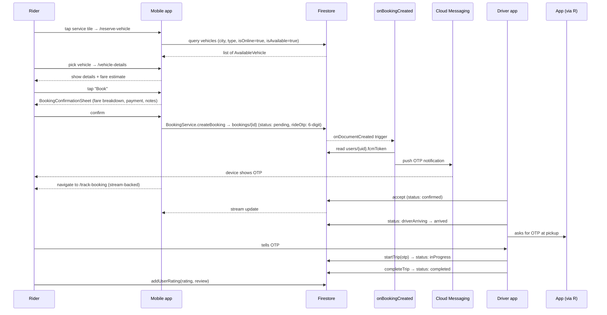

# 20 — Rider App Flow Documentation

End-to-end view of the **rider / customer** experience. Post-login route resolves to `/user-dashboard` for any user whose `users/{uid}.role` is `User`, `user`, or null (legacy accounts) — see `UserModel.isUser`.

## Top-level rider navigation map

## Sign-up / sign-in flow

## Dashboard composition

Source: `lib/screens/user/user_dashboard.dart` + `user_dashboard_provider.dart`.

| Element | Backing data |
|---|---|
| Location bar (top) | `LocationBar` widget; consumes `location_provider` (GPS + geocoding) |
| Banner slider | `BannerSlider` reading `banners` collection |
| Offer banners | `OfferBannerSlider` reading `offer_banners` |
| Quick-action service tiles | `QuickActionButton` × N (Reserve, Local, Outstation, Goods, etc.) |
| Active booking strip | Live snapshot of the rider's active booking (if any) |
| Side drawer | `ModernDrawer` with profile, saved addresses, history, support, sign out |
| FCM subscription | `notificationProvider.notifier.subscribeAsUser(uid)` on dashboard entry |

The dashboard handles a **double-back-to-exit** gesture via `_lastBackPressedAt`.

## Booking flow (rider's journey)

## Screen catalogue (rider-side)

| Screen | Route | Notes |
|---|---|---|
| Splash | `/splash` | `SplashScreen` |
| Auth hub | `/auth` | `AuthScreen` (variant landing) |
| Login | `/login` | `LoginScreen` — email + Google + phone CTA |
| Phone auth | `/phone-auth` | `PhoneAuthScreen` (calls `PhoneAuthNotifier`) |
| Register | `/registration` | `RegisterScreen` |
| Email verify | `/email-verification?userId=` | `EmailVerificationScreen` |
| Role select | `/role-selection?userId=` | `RoleSelectionScreen` |
| Forgot password | `/forgot-password` | `ForgotPasswordScreen` |
| User dashboard | `/user-dashboard` | `UserDashboard` |
| Reserve vehicle | `/reserve-vehicle` | `ReserveVehicleScreen` + `vehicle_search_provider` |
| Vehicle details | `/vehicle-details?vehicleId=` | `VehicleDetailsScreen` |
| Local transport | `/local-transport` | `LocalTransportScreen` |
| Outstation | `/outstation` | `OutstationScreen` |
| Book goods carrier | `/book-goods-carrier`, `/goods-transport`, `/mini-truck-delivery`, `/bike-parcel` | `BookGoodsCarrierScreen` (params change preset type & title) |
| Track booking | `/track-booking` | `TrackBookingScreen` — live status + driver location + OTP fallback |
| User ride history | `/user-ride-history` | `UserRideHistoryScreen` |
| Offers & rewards | `/offers-rewards` | `OffersRewardsScreen` |
| Promotions | `/promotions` | `PromotionsScreen` |
| Saved addresses | `/saved-addresses` | `SavedAddressesScreen` + `saved_address_provider` |
| User profile | `/user-profile` | `UserProfileScreen` |
| Notifications | `/notifications` | `NotificationsScreen` (reads `users/{uid}/notifications`) |
| Support center | `/support-center` | `SupportCenterScreen` (calls `createComplaint`, `createFeedback` Cloud Functions) |
| Emergency | `/emergency`, `/emergency-vehicle` | `EmergencyScreen` |

## Real-time state on the rider side

`TrackBookingScreen` subscribes to two streams simultaneously:

1. `BookingService.getBookingStream(bookingId)` — booking status + ETA + fare changes.
2. `LiveLocationService.getDriverLocationStream(driverId)` — driver lat/lng/heading/speed.

The OTP is always shown on this screen as a fallback to FCM delivery (`functions/index.js` notes: "the passenger can still read the OTP from the Track Booking screen in the app").

## Saved addresses

`SavedAddressesScreen` lists addresses from `users/{uid}/savedAddresses`. Add via the `AddAddressModal` (Google Places autocomplete + reverse-geocoded label). On the booking confirmation sheet, saved addresses appear as quick chips for pickup/drop.

## Support workflow

`SupportCenterScreen` exposes:
- **Raise complaint** — opens a form (subject, description, priority, optional image). On submit, calls the `createComplaint` callable Cloud Function which writes to `complaints/{id}` with a generated `ticketId = ZY-YYYYMMDD-NNN`.
- **Send feedback** — opens a rating + message form. On submit, calls `createFeedback`, returning a `feedbackId = FB-YYYYMMDD-NNN`.

Both endpoints require an authenticated context; the historic `data.userId` fallback is flagged as a security cleanup item (S-07 in [11](11-security-audit-report.md)).

## Notification permissions on the rider side

Permission prompt fires once during `NotificationService.initialize()` (post-first-frame in `MyApp`). If denied, OTP / status pushes won't arrive — but `TrackBookingScreen` always shows the OTP in-app and status changes are reflected via the live snapshot.

## Sign-out (rider)

`ModernDrawer` → Sign out calls `AuthService.signOut()`. Today this does **not** also call `removeFcmToken` or `unsubscribeAsUser` — those should be added (see [F-12](18-future-enhancements.md)).
