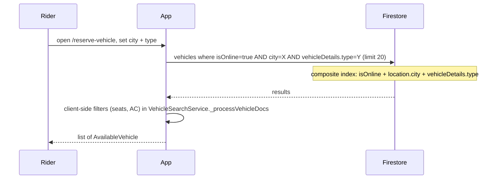
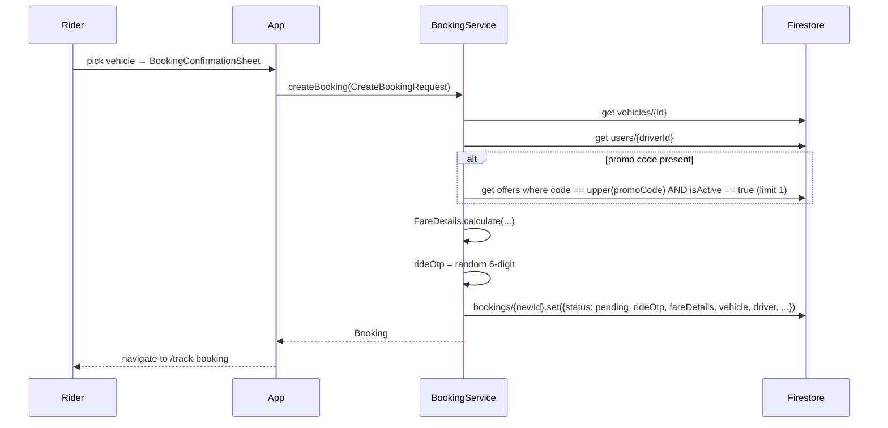
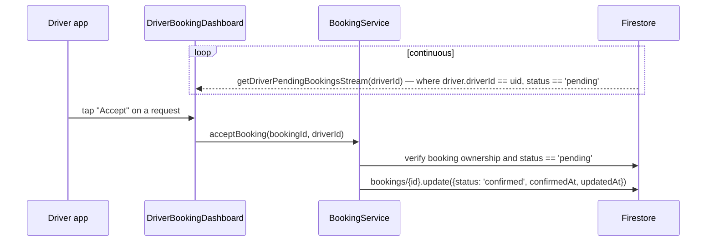
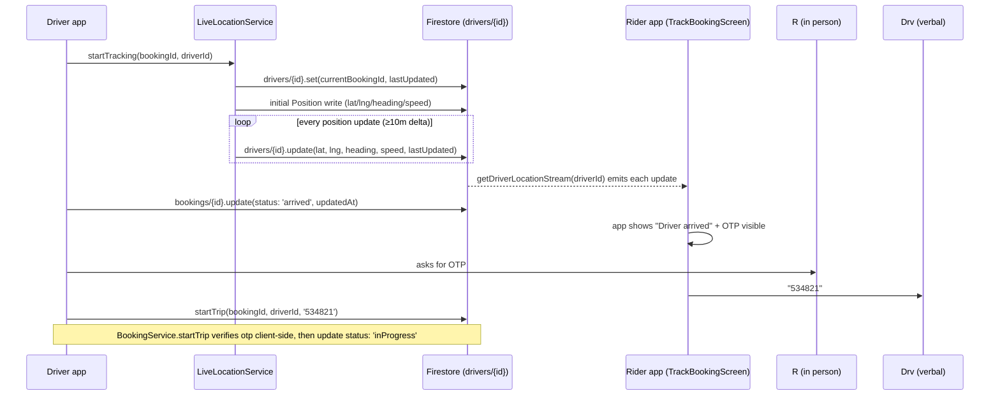
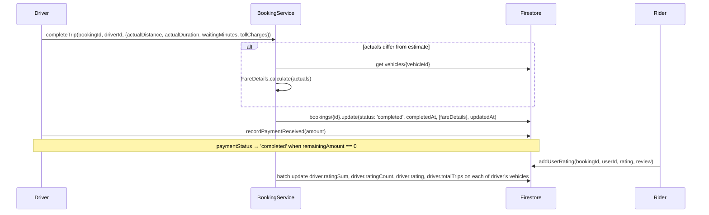

# 22 — Ride Booking Workflow

Authoritative end-to-end specification of the booking lifecycle as implemented. Cross-references: [06 — Firestore Schema](06-firestore-schema.md) for field shapes, [10 — API & Service Layer](10-api-and-service-layer.md) for method signatures.

## State machine

```mermaid
stateDiagram-v2
  [*] --> pending: BookingService.createBooking
  pending --> confirmed: driver accepts (acceptBooking)
  pending --> rejected: driver rejects (rejectBooking)
  pending --> cancelled: rider cancels (cancelBooking) - no fee
  pending --> expired: stale > N min (expireOldBookings; admin-only today)
  confirmed --> driverArriving: optional intermediate
  confirmed --> arrived: driverArrived
  driverArriving --> arrived: driverArrived
  arrived --> inProgress: startTrip(otp)
  inProgress --> completed: completeTrip
  confirmed --> cancelled: rider cancels - 20% base-fare fee after 2 min from confirm
  driverArriving --> cancelled: rider cancels
  completed --> [*]
  cancelled --> [*]
  rejected --> [*]
  expired --> [*]
  arrived --> [*]: cancellation also possible
```

Status values are stored as the enum's `.name` (camelCase: `pending`, `confirmed`, `driverArriving`, `arrived`, `inProgress`, `completed`, `cancelled`, `rejected`, `expired`).

## Phase 1 — Search



Failure modes:
- Missing index → `DatabaseException` (not silently downgraded to a broader query — by design).
- No results → empty list (UI shows "No vehicles available").

## Phase 2 — Confirmation & creation



Required fields on create (enforced by `firestore.rules`): `userId, userPhone, userName, bookingType, status, pickupLocation, dropLocation, vehicle, driver, fareDetails, paymentMethod, paymentStatus, createdAt, updatedAt`. The client must set `status == 'pending'`.

## Phase 3 — Driver acceptance



`acceptBooking` is a two-step server interaction (read + write) but is **not transactional**. Two drivers cannot be assigned to the same booking because the booking already carries `driver.driverId` at creation — a single specific driver is the *target* from creation onward, not a pool that drivers compete for. See [23 — Driver Assignment Workflow](23-driver-assignment-workflow.md).

## Phase 4 — En route → arrived → start



## Phase 5 — In-progress tracking

While the booking is `inProgress`:
- Driver app continues streaming location to `drivers/{driverId}` until `stopTracking()`.
- Rider app's `TrackBookingScreen` listens to the booking snapshot for status changes and to the driver location for the map marker.
- The rider can call/message the driver via `url_launcher` (tel:/sms:) — no in-app chat yet.

## Phase 6 — Completion



## Phase 7 — Cancellation (rider-initiated)

`BookingService.cancelBooking(bookingId, userId, {reason})`:

```dart
if (!booking.canCancel) return false;        // canCancel ⟺ status in [pending, confirmed]
final cancellationFee = booking.status == BookingStatus.confirmed
    ? booking.fareDetails.baseFare * 0.20    // 20% of base fare
    : null;
update({
  status: 'cancelled',
  cancellationReason: reason ?? 'Cancelled by user',
  cancelledBy: 'user',
  cancelledAt: now,
  cancellationFee,
  updatedAt: now,
});
```

`FareCalculator.calculateCancellationFee` provides a richer rule (free within 2 minutes of confirmation) but is **not** wired into `BookingService.cancelBooking` today — the current code charges 20 % for any rider cancellation after confirmation. This is an inconsistency to address.

## Phase 8 — Driver rejection

`BookingService.rejectBooking(bookingId, driverId, reason?)`:

- Allowed only when status is `pending`.
- Writes `status: 'rejected'`, `cancellationReason: reason ?? 'Driver rejected the booking'`, `cancelledBy: 'driver'`, `cancelledAt: now`.
- The rider's `getActiveBookingStream` will drop this booking from the active set (rejected is not in `[pending, confirmed, driverArriving, arrived, inProgress]`).

> The current implementation targets a single driver. There is no fallback that re-tries with a different driver — this is an opportunity for [23 — Driver Assignment Workflow](23-driver-assignment-workflow.md).

## Concurrency & integrity considerations

- **OTP generation:** uses `dart:math.Random()`, not `Random.secure()`. For high-value rides this should be tightened.
- **Fare snapshot:** taken at booking creation. Recalculation on completion only happens if actual distance/duration/waiting/toll differ.
- **No transactions** are used in this flow — every write is a single-doc update. This is safe because each booking has a single target driver and the rules' field whitelists prevent concurrent writers from stomping on each other's fields.
- **Per-driver active-booking invariant:** the codebase relies on the convention that a driver runs one ride at a time. There's no server constraint enforcing this — two simultaneous accepts on different bookings would both succeed.

## Failure-mode handling

| Failure | Behaviour |
|---|---|
| Push OTP fails | Rider still sees OTP in-app on `TrackBookingScreen` |
| Network drop mid-trip | Firestore offline cache buffers writes; reconnect flushes queue |
| Driver app killed | Live location stops; `LiveLocationService.stopTracking` cleanup only runs on graceful exit. The next time the driver opens the app and resumes the booking, tracking restarts. |
| Pending booking with no driver action | Stays `pending` indefinitely today; needs `expireOldBookings` Cloud Function ([F-08](18-future-enhancements.md)) |
| Invalid OTP attempt | Client counter on `DriverBookingDashboardScreen` locks the booking after 3 misses for 5 minutes |

## Audit trail

Every state change writes `updatedAt = Timestamp.now()` and the corresponding milestone timestamp (`confirmedAt`, `startedAt`, `completedAt`, `cancelledAt`). The booking document itself is never deleted (`firestore.rules` `allow delete: if false`), preserving a complete history.
