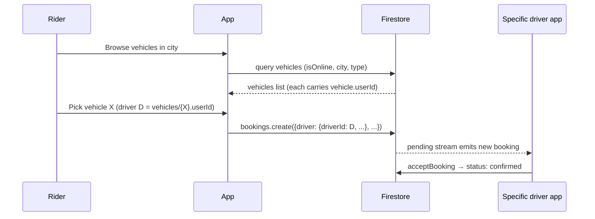
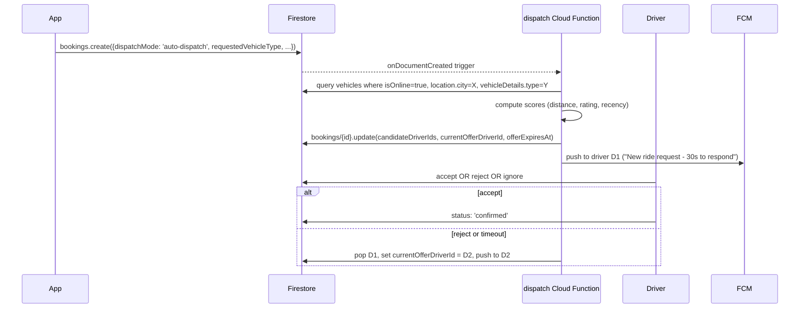

# 23 — Driver Assignment Workflow

## Current implementation (single-target assignment)

The current booking flow does **not** implement a dispatch pool. Every booking is created with a specific target driver baked in at creation time:

```dart
// lib/services/booking_service.dart — createBooking()
driver: BookingDriverDetails(
  driverId: request.driverId,       // ← chosen by the rider on the previous screen
  name: driverData['fullName'] ?? vehicle.driverName,
  phoneNumber: driverData['mobile'],
  photoUrl: driverData['profileImageUrl'],
  rating: vehicle.driverRating,
  totalTrips: vehicle.totalTrips,
),
```

The rider browses vehicles in their city (filtered by `isOnline == true`) on `ReserveVehicleScreen`, selects one, and the chosen vehicle's owner becomes the assigned driver. The driver-side dashboard then sees this booking in their `getDriverPendingBookingsStream` filtered by `driver.driverId == uid`.



### Properties of the current model

| Property | Yes / No | Notes |
|---|---|---|
| Rider picks the driver | ✅ | Implicit — by picking the vehicle |
| One-to-one assignment | ✅ | No driver bidding / racing |
| Fan-out to nearby drivers | ❌ | No broadcast on creation |
| Reassignment on rejection | ❌ | Rejection terminates the booking |
| Re-queue on timeout | ❌ | No timeout job runs in production today |
| Surge / supply-based reallocation | ❌ | No surge logic |

This model works well for "marketplace browse" UX (similar to BlaBlaCar / local rental aggregators) but does not match the on-demand dispatch model of an Uber-style app.

## Failure modes of the current model

| Scenario | Consequence today |
|---|---|
| Selected driver is offline by the time booking is created | Booking sits `pending`; driver never sees it; rider waits indefinitely |
| Driver rejects the booking | Status flips to `rejected`; rider sees rejection; no automatic fallback |
| Driver is online but engaged on another ride | Booking sits `pending` until they finish, may or may not accept |
| Driver is online but ignores the request | Booking sits `pending`; only manual rider cancellation closes it |

## Server-enforced guards

`firestore.rules` for `bookings`:
- Rider can create bookings only with `userId == auth.uid` and `status == 'pending'`. They cannot pre-set `driver.driverId` to someone they don't intend to ride with (well, they can — but only that driver will see it).
- Driver-side updates are gated by `resource.data.driver.driverId == auth.uid`, so a malicious driver cannot accept a booking targeted at a different driver.

## Proposed enhancement — dispatcher Cloud Function

The recommended evolution is a **server-side dispatcher** that decouples vehicle selection from driver assignment. This is the on-demand model.

### Phase 0 — Schema changes

Add new fields on `bookings/{id}`:

| Field | Type | Purpose |
|---|---|---|
| `dispatchMode` | string | `'rider-picked'` (current) or `'auto-dispatch'` |
| `requestedVehicleType` | string | when `auto-dispatch`, the rider only chose a *type* |
| `candidateDriverIds` | array<string> | drivers offered the ride, in order |
| `currentOfferDriverId` | string | the driver currently looking at the offer |
| `offerExpiresAt` | Timestamp | when the current offer auto-expires |
| `offerAttempt` | int | which attempt we're on |

### Phase 1 — Dispatcher trigger



A Cloud Scheduler job runs every 10 seconds to expire stale offers (`offerExpiresAt < now`) and advance to the next candidate. After exhausting `candidateDriverIds`, the booking flips to `expired`.

### Phase 2 — Scoring function

Pseudocode for candidate ranking:

```javascript
function score(driver, booking) {
  const distancePenalty = haversine(driver.location, booking.pickupLocation);
  const ratingBoost = (driver.rating - 4.0) * 0.5;     // small effect
  const recencyBoost = secondsSince(driver.lastOnlineAt) < 60 ? 0.2 : 0;
  return -distancePenalty + ratingBoost + recencyBoost;
}
```

Bias toward (a) closest, (b) highest-rated, (c) most recently active. Surge / supply pricing can also factor into priority.

### Phase 3 — Driver UX

Driver app shows a 30-second countdown card with accept / reject buttons. Inaction is treated as reject.

### Phase 4 — Migration plan

1. Add `dispatchMode` defaulting to `'rider-picked'` so existing bookings keep working.
2. Add an `/auto-dispatch` route alongside `/reserve-vehicle` that lets the rider select only a vehicle *type*.
3. Iterate: instrument fallback rate, dispatch latency, driver acceptance rate.

## Hybrid model (recommended initial step)

Until the dispatcher exists, add a lightweight safety net:

- A scheduled Cloud Function every 5 min that flips `pending` bookings older than 10 min to `expired` (see [F-08](18-future-enhancements.md)).
- A push to the rider explaining that no driver responded, with an "Try again" deep-link to the same flow.

## Distance / location data for scoring

The codebase already stores driver location at `drivers/{driverId}` with `latitude`, `longitude`, `lastUpdated`. The vehicle's static `location` (registered city) is on `vehicles/{id}`.

For accurate live distance, the dispatcher must use `drivers/{id}.location` (live GPS) rather than `vehicles/{id}.location` (static registration city). Distance can be computed in the Cloud Function via the haversine formula or via a third-party routing API (Google Routes, OSRM).

## Driver-eligibility gates the dispatcher must respect

When building the candidate list, the dispatcher must filter to drivers that satisfy **all**:

1. `users/{uid}.verificationStatus == 'approved'`
2. `vehicles/{vehicleId}.documentStatus == 'approved'`
3. `vehicles/{vehicleId}.isOnline == true`
4. `vehicles/{vehicleId}.isAvailable == true` (schedule-derived)
5. No active booking on the driver (status in `[confirmed, driverArriving, arrived, inProgress]`) — would require a per-driver active-booking index

The same gates already exist for the rider-pick model in `VehicleSearchService.searchVehicles`.

## Concurrency control

The race condition to consider: two riders book the same driver within the same second. Today this can both succeed. To prevent it:

```javascript
// in the dispatch function, wrap the assignment in a transaction
await admin.firestore().runTransaction(async (tx) => {
  const driverDoc = await tx.get(driverRef);
  if (driverDoc.data().currentBookingId) {
    throw new Error('Driver already engaged');
  }
  tx.update(driverRef, { currentBookingId: bookingId });
  tx.update(bookingRef, { status: 'confirmed', driver: { ...driverInfo } });
});
```

The `drivers/{id}.currentBookingId` field already exists for live tracking — reusing it as a lightweight lock requires no schema change.
