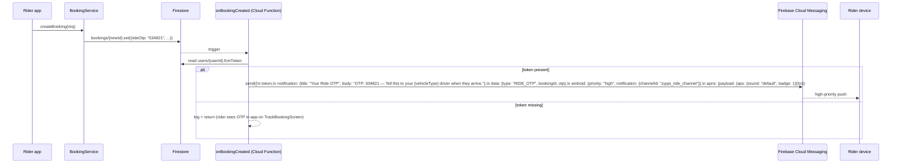
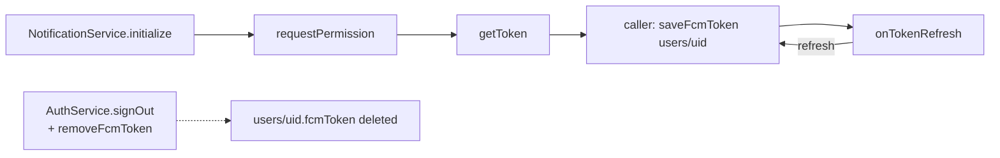

# 25 — Notification Flow

Complementary to [08 — Push Notifications](08-push-notifications.md) — that document is the architecture overview; this document is the **end-to-end flow** for each notification type, including foreground vs background handling, payload shapes, and what the user actually sees.

## Stack and lifecycle (recap)

| Layer | Implementation |
|---|---|
| Cloud transport | Firebase Cloud Messaging (FCM) |
| Server sender | Cloud Function (`functions/index.js` → `onBookingCreated`) and (recommended) future status-change function |
| Client receiver | `lib/services/notification_service.dart` |
| Foreground display | `flutter_local_notifications` channel `zyppi_ride_channel` |
| Background entry | Top-level `firebaseMessagingBackgroundHandler` in `notification_service.dart` |
| Token persistence | `users/{uid}.fcmToken` (set on init, removed on sign-out) |
| In-app history | `users/{uid}/notifications/{notifId}` subcollection (created server-side) |

## Notification taxonomy (today + recommended)

| Type | `data.type` value | Trigger | Currently implemented? |
|---|---|---|---|
| Ride OTP | `RIDE_OTP` | `bookings/{id}` created | ✅ (`onBookingCreated`) |
| New ride request (driver-bound) | `RIDE_REQUEST` | new pending booking targeted at a driver | ❌ — recommended addition |
| Driver accepted | `BOOKING_CONFIRMED` | `bookings.status: pending → confirmed` | ❌ |
| Driver arriving | `DRIVER_ARRIVING` | `bookings.status: confirmed → driverArriving` | ❌ |
| Driver arrived | `DRIVER_ARRIVED` | `bookings.status: → arrived` | ❌ |
| Trip started | `TRIP_STARTED` | `bookings.status: → inProgress` | ❌ |
| Trip completed | `TRIP_COMPLETED` | `bookings.status: → completed` | ❌ |
| Cancellation | `BOOKING_CANCELLED` | `bookings.status: → cancelled / rejected / expired` | ❌ |
| Marketing | `MARKETING` | topic-based, manual send | ❌ — topics subscribed but no sender |
| Doc expiry warning | `DOC_EXPIRY` | scheduled job 14 days before `drivingLicenseValidUpto` | ❌ |
| Support reply | `SUPPORT_REPLY` | admin updates `complaints/{id}` | ❌ |

## The one implemented flow — RIDE_OTP push



### What the user sees by app state

| App state | Behaviour |
|---|---|
| **Foreground** | `FirebaseMessaging.onMessage` fires → `_handleForegroundMessage` → `showLocalNotification(title, body, payload)` displays a head-up notification via `flutter_local_notifications`. |
| **Background** | The OS shows the notification directly in the system tray (FCM payload includes `notification:` block). `firebaseMessagingBackgroundHandler` runs only for logging. |
| **Killed (cold start)** | OS shows the notification. When the user opens the app via the notification, `FirebaseMessaging.instance.getInitialMessage()` returns it → `_handleNotificationTap` → calls the optional `onNotificationTap` callback. |

## Foreground display details

```dart
const androidDetails = AndroidNotificationDetails(
  'zyppi_ride_channel',
  'Zyppi Ride Notifications',
  channelDescription: 'Notifications for ride updates',
  importance: Importance.high,
  priority: Priority.high,
  icon: '@mipmap/ic_launcher',
);
```

Each foreground notification uses an ID derived from `DateTime.now().millisecondsSinceEpoch.remainder(100000)` — collision-free in practice.

## Payload encoding

Local notifications take a single `String` payload, while `RemoteMessage.data` is a `Map<String, dynamic>`. The codebase round-trips via `_encodePayload`/`_decodePayload`:

```dart
String _encodePayload(Map<String, dynamic> data) =>
    data.entries.map((e) => '${e.key}=${e.value}').join('&');

Map<String, dynamic> _decodePayload(String payload) {
  final map = <String, dynamic>{};
  for (final part in payload.split('&')) {
    final eqIndex = part.indexOf('=');  // preserves values containing '='
    if (eqIndex > 0) {
      map[part.substring(0, eqIndex)] = part.substring(eqIndex + 1);
    }
  }
  return map;
}
```

The use of `indexOf('=')` rather than `split('=')` is deliberate so values containing `=` (URLs, base64) survive. **Limitation**: values containing `&` break parsing — switch to JSON if you ever need to embed richer payloads (see [F-10 in 18-future-enhancements](18-future-enhancements.md)).

## Token lifecycle



Today `AuthService.signOut` does **not** call `removeFcmToken` or topic-unsubscribe — see [F-12](18-future-enhancements.md). Add a single `AuthFlowController` that orchestrates: token removal → topic unsubscribes → Firebase sign-out → optional `clearPersistence`.

## Topic subscription matrix

| User type | Subscribed topics |
|---|---|
| Rider | `all_users`, `users`, `user_{uid}` |
| Driver | `all_users`, `drivers`, `driver_{uid}` |

API methods on `NotificationService`:
- `subscribeAsUser(userId)` / `unsubscribeAsUser(userId)`
- `subscribeAsDriver(userId)` / `unsubscribeAsDriver(userId)`
- `subscribeToTopic(topic)` / `unsubscribeFromTopic(topic)` (general)

**Marketing campaigns** can be sent to `all_users`, `users`, or `drivers`. The repository contains no sender today; use the Firebase Console for ad-hoc sends or build a small admin-panel function for scheduled campaigns.

## In-app notification history

The `users/{uid}/notifications/{notifId}` subcollection is reserved for an in-app inbox UI (`NotificationsScreen`). Rules:

```
allow create: if false;                                       // Cloud Functions only
allow read:   if request.auth.uid == userId;
allow update: if request.auth.uid == userId &&
                 request.resource.data.diff(resource.data).affectedKeys().hasOnly(['isRead']);
allow delete: if request.auth.uid == userId;
```

**Today, no Cloud Function writes to this subcollection.** It's plumbing waiting for use. Recommended pattern: every push-notifying Cloud Function should *also* write a doc here (title, body, type, data, isRead: false, createdAt) so the user has a persistent in-app history even if they dismissed the push.

## App Check & FCM

Cloud Messaging does **not** require App Check tokens to deliver messages — App Check is for Firestore / Storage / Functions. So a misconfigured App Check setup won't break notifications, but a misconfigured FCM SHA / GoogleService-Info won't be obvious from the App Check error path.

## Permission UX recommendations

| Platform | Recommendation |
|---|---|
| Android 13+ | Show a pre-prompt ("To get ride OTPs delivered instantly, allow notifications") **before** triggering the system dialog — system dialogs only show once, so a denial sticks. |
| iOS | Same — Apple's review guidelines effectively require purpose-driven pre-prompts. |
| All platforms | If denied, show a persistent in-app banner on `TrackBookingScreen` saying "OTP visible below; enable notifications for instant delivery". |

## Diagnostics & verification

**Smoke test on a real device:**
1. Sign in, confirm `users/{uid}.fcmToken` is populated.
2. Use the Firebase Console → Cloud Messaging → "Send test message" with that token; you should see a notification within a few seconds.
3. Create a booking from the rider app; the OTP should arrive promptly.
4. Force-kill the app; create another booking; confirm the system tray shows the OTP.

**Common pitfalls:**
- `users/{uid}.fcmToken` empty → notification permission denied or `saveFcmToken` was never called.
- "Push works in debug but not release" → release build signed with debug keystore (S-01) or wrong `google-services.json`.
- "Push works on Android but not iOS" → APNs certificate not uploaded to Firebase Console, or App Tracking Transparency not configured for iOS 14+.
