# 28 — Scalability Assessment (100K+ users)

## Target scenario

For this assessment we model:

| Variable | Assumption |
|---|---|
| Monthly active users (MAU) | 100,000 (riders) |
| Active drivers | 8,000 (1:12 ratio) |
| Bookings per active rider per month | 6 |
| Total bookings per month | 600,000 (~20,000 / day, ~14 / min average, ~50–100 / min at peak) |
| Avg trip duration | 25 minutes |
| Peak-concurrent active trips | ~3,000 |

The architecture must hold up to **3,000 concurrent live-tracked trips**.

## Component-by-component verdict

### Firebase Auth — ✅ scales effortlessly

Firebase Auth is engineered for hundreds of millions of users. No structural changes needed up to 1M+ MAU. Concerns at this scale are bill (Phone Auth SMS) and abuse (S-03 in [11](11-security-audit-report.md)).

**Actions:** enforce App Check on phone auth; add client-side resend cooldown.

### Cloud Firestore — ⚠️ structural changes needed

Firestore's hard limits to be aware of:

| Limit | Value |
|---|---|
| Sustained write rate to a single document | 1 write/sec |
| Sustained write rate to a single collection or composite index | 500 writes/sec without sharding (hot-spot risk above) |
| Snapshot listeners per client | 100 |
| Max document size | 1 MiB |
| Reads per second per client | unlimited (but bill-driven) |

**Risk areas at 100K scale:**

1. **`drivers/{driverId}` writes** — each driver writes their own doc, so no hot-spot risk on a single doc. But the **collection-wide** rate could approach 500/s during peak. At 3,000 concurrent trips × 0.5–1.4 writes/sec/driver = **1,500 – 4,200 writes/sec on `drivers/`**. This **will exceed Firestore's smooth-write threshold for a single collection**, triggering 429 throttling.

   - **Mitigation A:** move location to **Realtime Database** (designed for this).
   - **Mitigation B:** shard `drivers/` by city: `drivers_{city}/{driverId}`. Each city collection caps at 500 writes/sec.
   - **Mitigation C:** reduce write frequency (distance filter at 25–50 m + per-3-sec throttle).

2. **`bookings/` writes during dispatch** — at 50–100 bookings/min peak, that's ~1.5 writes/sec on the collection. **Safe.**

3. **`bookings/{id}` doc hot writes** — multiple parties (driver + rider + maybe admin) updating the same booking doc concurrently are within the 1 write/sec/doc limit unless the trip is in a tight back-and-forth state. **Generally safe.**

4. **Composite index storage cost** — `bookings/` has 7 composite indexes (see [06](06-firestore-schema.md)). Each index doubles per-write cost. At 600k bookings/month, the per-month bill for composite-index writes alone scales linearly.

5. **`getDriverStats` / `getUserStats`** load every completed booking — at 1,000 trips/driver this is 1,000 reads per dashboard view. **Won't scale.** Must move to aggregate docs.

### Cloud Storage — ✅ scales effortlessly

GCS scales to billions of objects. The risks are:
- **Cold-cache bandwidth** on first visit to a driver/vehicle list view — mitigate with `Cache-Control` + `cached_network_image`.
- **Storage cost growth** — old signature images, expired RC scans. Add lifecycle rules.

### Cloud Functions — ✅ scales horizontally; tune cold starts

Functions scale automatically up to 1,000 concurrent instances per function (default). At 50 bookings/min peak (~1/sec), `onBookingCreated` invocations are trivial.

**Cold-start concern:** if a rider waits 5–10 seconds for the OTP push, the cold start is contributing. Set `minInstances: 1` on the OTP function.

**Recommended additions stay safe at scale:**
- `onBookingStatusChanged` push function — same trigger frequency as bookings.
- `dispatchBooking` function — runs on creation + every 10s for retries — well within limits.

### Cloud Messaging — ✅ free, scales

FCM has no realistic throughput limit at this scale (Google sends billions per day across all apps). The bottleneck is per-device delivery — APNs / FCM may rate-limit if you send dozens of messages per second to the same device, but a normal Zyppi user receives few per day.

### App Check — ✅ negligible overhead

Token attestation runs on-device; no server-side cost.

## End-to-end load model

```mermaid
flowchart LR
  subgraph Concurrent[~3,000 concurrent trips]
    LocWrites["~3,000 × 1/sec\n= 3,000 writes/sec on drivers/"]
    BookSnap["~3,000 × 2 streams open\n= 6,000 active snapshots"]
  end
  LocWrites -.exceeds 500/sec threshold.-> Mitigation[Shard by city OR move to RTDB]
  BookSnap -.fine.-> OK
```

## Capacity-planning levers (ranked)

### Tier A — Must do before 100K MAU

1. **Move driver location to Realtime Database** or **shard `drivers/` by city**.
   *Why:* Avoids the 500 writes/sec/collection hot-spot.
2. **Aggregate dashboards** (`drivers/{uid}/stats/aggregate`, same for users).
   *Why:* Removes O(history) reads on dashboard load.
3. **autoDispose providers** for all stream-backed consumers.
   *Why:* Prevent ever-growing snapshot listener counts.
4. **Composite-index audit** quarterly.
   *Why:* Each unused index is dead write cost.
5. **Production keystore + App Check enforcement** (S-01, S-11 from [11](11-security-audit-report.md)).
   *Why:* App Store readiness + abuse prevention.

### Tier B — Strongly recommended

6. **Cloud Function dispatcher** (see [23](23-driver-assignment-workflow.md)) — fan out to multiple drivers, retry on timeout. Replaces the single-target-driver model.
7. **Scheduled `expireOldBookings` function** — pending bookings need a server-side reaper.
8. **BigQuery export** for analytics — Firebase Console → Firestore → Export → BigQuery integration. Off-loads read-heavy analytical queries.
9. **`onBookingStatusChanged`** push function so riders see status updates without keeping the app open.
10. **Driver-availability index in-memory** — cache nearby drivers in a Cloud Function memory or Redis to avoid repeated `vehicles where isOnline=true AND city=X AND type=Y` reads on every dispatch.

### Tier C — At 500K+ MAU

11. **Geohash-based driver indexing** for efficient "nearest N drivers" queries.
12. **Memcache layer** in front of Firestore for hot static data (vehicle catalog, banner content). Firebase Hosting + Cloud CDN works for static assets.
13. **Move marketing comms** (banners, offers) to **Remote Config** — zero Firestore reads.
14. **Split monolithic Firestore project** if multi-region: a per-region Firestore namespace + a global routing function.

## Concurrency stress test (recommended)

Before going to 100K, run a **synthetic load test**:

1. Spin up 3,000 test users via Auth admin SDK.
2. Use a `flutter_driver` harness to simulate the trip lifecycle (or a thin Node.js client that mimics Firestore traffic patterns).
3. Drive ~3,000 concurrent trips for 30 minutes.
4. Watch the Firebase Console for 429 throttling, latency spikes, function timeouts.
5. Verify your monitoring catches it (see Production Readiness).

If you don't run a load test, your first real "100K user" event will be the test — and customer-facing.

## Multi-region considerations

The default Firestore is **nam5 (multi-region US)**. For an Indian user base, this adds ~150–250 ms per round-trip. At 100K MAU this becomes a noticeable UX issue.

**Recommendation:** move to **asia-south1 (Mumbai)** or **asia-south2 (Delhi)** regional Firestore. Migration requires creating a new Firebase project (regional Firestore cannot be re-located in place) — significant effort. **Do this before crossing 10K MAU**; it's much more painful afterwards.

## Data model considerations at scale

- **Soft-delete users** (`disabled: true`) rather than hard-delete — cascades into bookings/vehicles/agreements are messy.
- **Archive old bookings** (> 1 year) to a cheaper store (BigQuery, Cloud Storage NDJSON dumps). The collection-group queries stay fast on the hot data.
- **Use `whereIn` sparingly** — limit of 30 values per filter; performance degrades past ~10.

## Estimated steady-state numbers at 100K MAU

| Metric | Per minute (peak) | Per day |
|---|---|---|
| New bookings | 50–100 | ~20,000 |
| Firestore reads | 5,000–10,000 | ~5M |
| Firestore writes (with mitigations) | 2,000–5,000 | ~3M |
| Storage upload events | ~10 | ~2,000 |
| Cloud Function invocations | ~100 | ~50,000 |
| FCM messages sent | ~200 | ~80,000 |

## Bottom line

The codebase is **architecturally sound for 10K MAU** out of the box. Crossing to 100K requires Tier A mitigations — **most notably, moving live-location writes off Firestore or sharding the `drivers/` collection by city.** Without this, you will hit Firestore's 500-writes/sec/collection throttle during peak hours and bookings will start failing in user-visible ways.

The good news: every Tier A item is a focused, well-bounded engineering project that can ship in days, not months.
