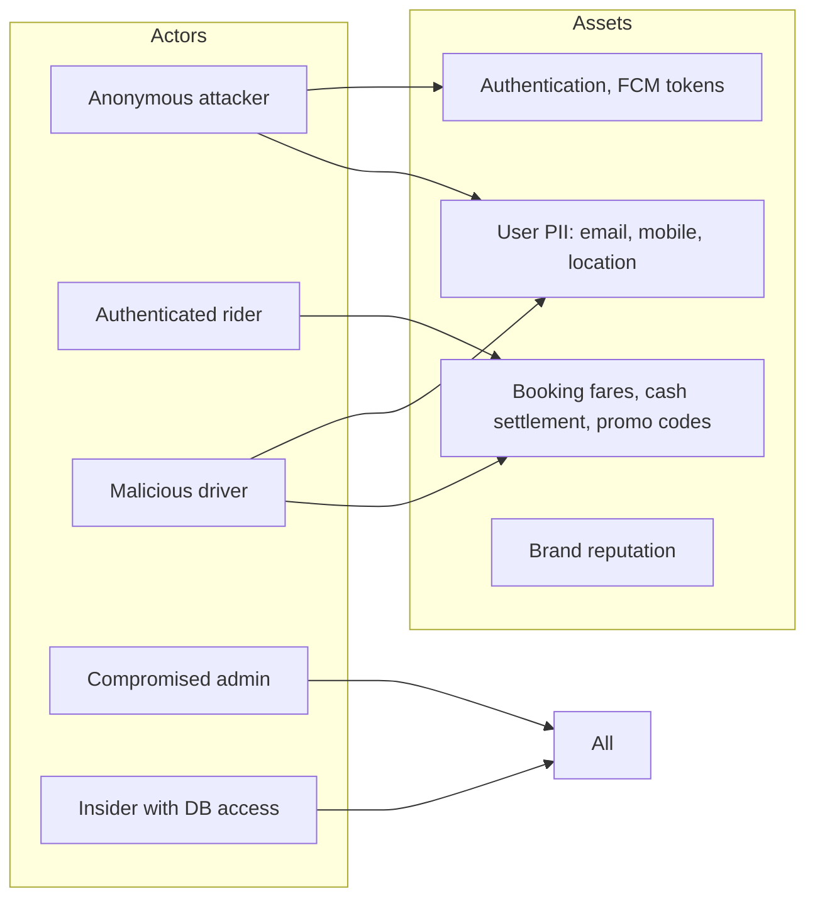

# 30 — Security Vulnerability Assessment

This is a focused security review **separate from** the broader audit in [11 — Security Audit Report](11-security-audit-report.md). Where [11] documents the design and gives prioritised remediation, this document maps the codebase against well-known threat categories (OWASP MASVS, OWASP API, CWE) and ranks findings by exploitability.

Severity scale: **Critical / High / Medium / Low / Info**.
Exploitability: **Trivial / Easy / Moderate / Difficult / Theoretical**.

## Threat model

## Vulnerability findings

### V-01 [Critical / Easy] Production builds signed with debug keystore
**Mapping:** OWASP MASVS-RESILIENCE — improper code signing.
**Where:** `android/app/build.gradle.kts` — `signingConfigs.getByName("debug")` referenced from the `release` build type.
**Impact:** Indistinguishable from any APK signed by anyone with the debug keystore. Update path is unrecoverable.
**Exploit:** Trivial — any party with the debug keystore (which is shared across all Flutter devs) can sign updates.
**Status:** Open (S-01 in [11]).
**Fix:** Generate `upload-keystore.jks`, configure `key.properties`, swap the `release` `signingConfig` reference. See [12 — Deployment Guide](12-deployment-guide.md).

---

### V-02 [Critical / Trivial — historical] Firebase Admin SDK key committed
**Mapping:** OWASP API3:2023 — Broken Object Property Level Authorization (effective).
**Where:** git history, removed by commit `01b0d30`.
**Impact:** Anyone with that key has full read/write to all of Firestore, Storage, Auth, etc. It bypasses every security rule.
**Exploit:** Trivial until the key is rotated.
**Status:** **NOT FULLY REMEDIATED.** Removing the file from the working tree does not invalidate the key.
**Fix:** Rotate the key in GCP Console → IAM → Service Accounts immediately.

---

### V-03 [High / Easy] No server-side rate limit on phone-auth resend
**Mapping:** OWASP API4:2023 — Unrestricted Resource Consumption (SMS bombing).
**Where:** `PhoneAuthNotifier.sendOtp` — only Firebase's per-project quota applies.
**Impact:** Attacker scripts SMS-bombing → SMS cost explosion.
**Exploit:** Easy — write a loop calling `sendOtp` for arbitrary phone numbers (no `to:` validation either).
**Status:** Open (S-03 in [11]).
**Fix:** Client-side cooldown + App Check enforcement on phone auth + reCAPTCHA (Firebase Console toggle).

---

### V-04 [High / Moderate] OTP brute-force protection only client-side
**Mapping:** OWASP MASVS-AUTH-3 — Authenticator rotation.
**Where:** `DriverBookingDashboardScreen` enforces `_maxOtpAttempts = 3` per booking. The actual OTP comparison runs in `BookingService.startTrip` (client → Firestore). A modified client can bypass both checks.
**Impact:** A malicious driver could brute-force their assigned-rider's OTP (1-in-900,000 per attempt with no lockout).
**Exploit:** Moderate — requires a modified APK. Real risk is low at scale today, but grows with active drivers.
**Status:** Open (S-06 in [11]).
**Fix:** Move OTP comparison and attempt counting to a Cloud Function. Lock the booking after N misses server-side.

---

### V-05 [High / Easy] `createComplaint`/`createFeedback` accept unauthenticated `data.userId`
**Mapping:** OWASP API2:2023 — Broken Authentication (defective).
**Where:** `functions/feedback-suggestion-fun.js` — both callables fall back to `data.userId` if `context.auth` is missing.
**Impact:** Anyone can spam tickets / fake feedback against any known UID. Pollutes support inbox, skews satisfaction metrics.
**Exploit:** Easy — call the function with `{userId: '<some uid>', subject: 'spam'}` from any HTTP client.
**Status:** Open (S-07 in [11]).
**Fix:** Drop the fallback. Require `context.auth` and use `context.auth.uid`.

---

### V-06 [High / Easy] `users` document update — owner can write arbitrary fields
**Mapping:** OWASP API3:2023 — Broken Object Property Level Authorization.
**Where:** `firestore.rules` `match /users/{userId}` update — only `isAdmin` and `verificationStatus` transitions are constrained.
**Impact:** Owner can overwrite their own `verificationApprovedAt`, `verificationNotes`, `drivingLicenseValidUpto`, `fcmToken`, `totalRides`, `rating`, etc.
**Exploit:** Easy — write any field except `isAdmin` via the Firestore SDK.
**Status:** Open (S-04 in [11]).
**Fix:** Add `affectedKeys().hasOnly([...])` whitelist of editable fields.

---

### V-07 [Medium / Trivial] Storage rules — no size or content-type cap on `users/` and `support/` paths
**Mapping:** OWASP API4:2023 — Unrestricted Resource Consumption.
**Where:** `storage.rules` — `vehicles/` is capped at 5 MB + `image/*`; `users/` and `support/` accept any size, any type.
**Impact:** Authenticated user can upload arbitrary large files; bandwidth + storage cost.
**Exploit:** Trivial.
**Status:** Open (S-13 in [11]).
**Fix:** Mirror the 5 MB + content-type rule.

---

### V-08 [Medium / Easy] `metadata/vehicleSearchMeta` arbitrary writes
**Mapping:** OWASP API3 — Broken Object Property Level Authorization.
**Where:** `firestore.rules` — clients can write to `metadata/vehicleSearchMeta` with any string array values.
**Impact:** Search dropdown pollution (typos, profanity). Soft data-quality risk, not confidentiality.
**Exploit:** Easy.
**Status:** Open (S-05 in [11]).
**Fix:** Restrict writes to admin / Cloud Function only; trigger updates from `vehicles.onCreate` instead of client.

---

### V-09 [Medium / Difficult] OTP generation uses non-secure RNG
**Mapping:** CWE-330 — Use of Insufficiently Random Values.
**Where:** `BookingService._generateOtp()` → `dart:math.Random()`. The default `Random()` is **not** cryptographically secure.
**Impact:** A motivated attacker who can observe several OTPs could potentially predict subsequent ones.
**Exploit:** Difficult in practice — they'd need many OTP samples from the same Random instance.
**Status:** Open.
**Fix:** Use `Random.secure()` (also `dart:math`). Better: generate OTP in the Cloud Function before persisting the booking.

---

### V-10 [Medium / Theoretical] Live-location stalking via prolonged rider session
**Mapping:** OWASP MASVS-PRIVACY-1.
**Where:** `drivers/{driverId}` read rule allows the rider on the **active** booking to read GPS. After the trip, `currentBookingId` is cleared by `stopTracking`; but if `stopTracking` doesn't run (app killed mid-trip), the field stays set.
**Impact:** A rider whose driver-app crashed could continue to read that driver's location beyond their booking.
**Exploit:** Theoretical — requires a coincidence of timing + a malicious rider client.
**Status:** Open.
**Fix:** Cloud Function on `bookings.status → completed | cancelled | rejected` that clears `drivers/{driverId}.currentBookingId`.

---

### V-11 [Medium / Easy] No mock-location detection
**Mapping:** OWASP MASVS-RESILIENCE — Geo-spoofing.
**Where:** `LiveLocationService._writeLocation` writes any `Position` the OS provides.
**Impact:** A driver using a mock-location app can fake GPS — collect cancellation fees by claiming to arrive, or game distance-based fare on cash settlement.
**Exploit:** Easy — Android has freely available mock-location apps.
**Status:** Open.
**Fix:** Check `Position.isMocked` before writing; refuse writes when set, and flag the booking for review.

---

### V-12 [Low / Easy] Payload encoding loses values containing `&`
**Mapping:** CWE-150 — Improper Neutralization of Escape, Meta, or Control Sequences.
**Where:** `NotificationService._encodePayload`.
**Impact:** Today only short keys (`type`, `bookingId`, `otp`) — safe. Future payloads with URLs / longer text could lose data.
**Exploit:** Trivial in theory; not exploitable today.
**Status:** Open (S-09 in [11]).
**Fix:** JSON-encode the payload.

---

### V-13 [Low / Easy] No anti-tampering attestation on driver location writes
**Mapping:** OWASP MASVS-RESILIENCE.
**Where:** `drivers/{driverId}` update rule only checks the field whitelist; the **values** are unverified.
**Impact:** Driver could submit a location that's miles from where the actual device is. Limited harm because the rider sees real-time location on the map (visibly wrong = visibly wrong).
**Exploit:** Easy with a modified client.
**Fix:** Server-side sanity check (Cloud Function trigger): if reported location is > 50 km from previous in < 60 s, flag and reject.

---

### V-14 [Low / Trivial] Firestore offline cache holds sensitive data on shared devices
**Mapping:** OWASP MASVS-STORAGE-1.
**Where:** 100 MB Firestore cache.
**Impact:** Trip history, addresses, OTP, fare recoverable on a phone after device sale if cache isn't cleared.
**Exploit:** Trivial (with device access).
**Status:** Open (S-11 in [11]).
**Fix:** On sign-out, call `FirebaseFirestore.instance.terminate()` and `clearPersistence()`. Currently `AuthService.signOut` does neither.

---

### V-15 [Low / Difficult] `verifyPhoneNumber` is deprecated in `firebase_auth: ^6.0.2`
**Mapping:** OWASP MASVS-CODE — Library hygiene.
**Where:** `AuthService.verifyPhoneNumber`.
**Impact:** Will break at the next major version bump.
**Exploit:** N/A (not a vulnerability, but tech debt with security implications).
**Status:** Open (S-08 in [11]).
**Fix:** Migrate to the new sign-in-with-phone API.

---

### V-16 [Low / Theoretical] No `dispatchMode` racing — two riders can target the same driver
**Mapping:** OWASP API3 (effective): no concurrency control on driver assignment.
**Where:** Booking creation flow.
**Impact:** Two simultaneous bookings to the same driver both succeed; the driver sees both pending requests.
**Exploit:** Theoretical (rare timing window).
**Fix:** See [23 — Driver Assignment Workflow](23-driver-assignment-workflow.md) — wrap assignment in a Firestore transaction using `drivers/{id}.currentBookingId` as the lock.

---

### V-17 [Low / Trivial] No "Delete my account" flow
**Mapping:** GDPR Art. 17 — Right to erasure; Play Store policy 2024+.
**Where:** Codebase has no such flow.
**Impact:** Non-compliance with privacy laws and Play Store requirements (blocking for new submissions).
**Exploit:** N/A — compliance gap.
**Fix:** Add `AuthService.deleteAccount` + a Cloud Function that scrubs the user's bookings (anonymise), vehicles, agreements, addresses, notifications. Add a UI affordance in profile.

---

### V-18 [Info] FCM token logging in debug
**Where:** `AppLogger.debug('Token: ${token.substring(0, 20)}...', tag: 'FCM')`.
**Status:** Acceptable — only debug builds, and only first 20 chars.

---

### V-19 [Info] Bare `print` in `TestMode.logTestMode`
**Where:** `lib/core/constants/test_mode.dart`.
**Status:** Acceptable — deliberate banner output, only fires in test mode.

---

### V-20 [Info] No code obfuscation flag in Flutter build
**Where:** Build commands in [12](12-deployment-guide.md).
**Recommendation:** `flutter build appbundle --release --obfuscate --split-debug-info=build/symbols/`. Adds minor build complexity, makes static analysis of the APK harder.

## Compliance posture

| Standard | Status |
|---|---|
| OWASP MASVS Level 1 (general apps) | Partial — most controls in place, V-01/V-04/V-14 are gaps |
| OWASP MASVS Level 2 (sensitive apps) | Not met — V-09, V-11, V-14, plus need biometric step-up for payment recording |
| GDPR | Not met — V-17 |
| Indian DPDP Act 2023 | Not met — no consent management, no notice screen |
| PCI-DSS | N/A today (no card data handled); becomes relevant when online payments ship |

## Recommended remediation order

| Priority | Items |
|---|---|
| **Within 1 week** | V-02 (rotate key), V-01 (production keystore), V-05 (remove userId fallback), V-17 (delete-account flow) |
| **Within 1 month** | V-03 (resend cooldown + App Check), V-06 (users update whitelist), V-04 (server-side OTP), V-07 (storage caps), V-10 (clear `currentBookingId` on completion) |
| **Within 3 months** | V-08 (metadata writes), V-09 (Random.secure / Cloud Function OTP gen), V-11 (mock-location detection), V-14 (sign-out cache clear), V-16 (assignment concurrency) |
| **Backlog** | V-12, V-13, V-15, V-20 |

## Penetration-testing recommendations

Before a public launch, commission an external pen test focused on:

1. **API abuse** — fuzz the Firestore client API and the callable Cloud Functions; verify rules hold up under abuse.
2. **OTP brute force** — measure how many attempts a modified driver client can make per second.
3. **Mock-location** — verify whether falsified GPS can drive fare manipulation.
4. **Phone-auth abuse** — SMS bombing surface.
5. **Privilege escalation** — confirm `isAdmin` is unreachable from any client write path.

A focused 2-week engagement with a mobile-security firm is typical for an app at this stage.
